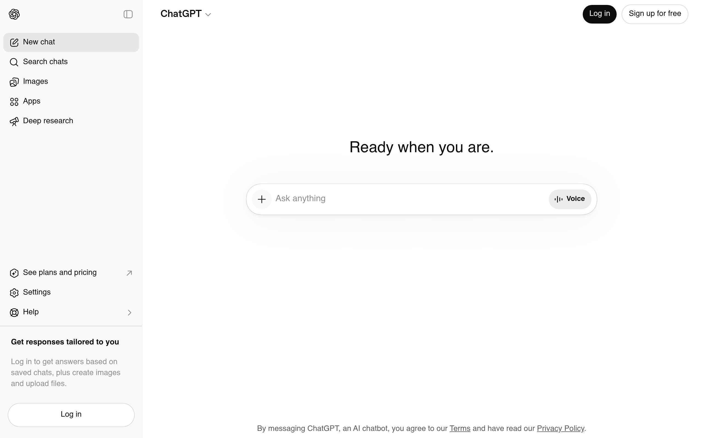
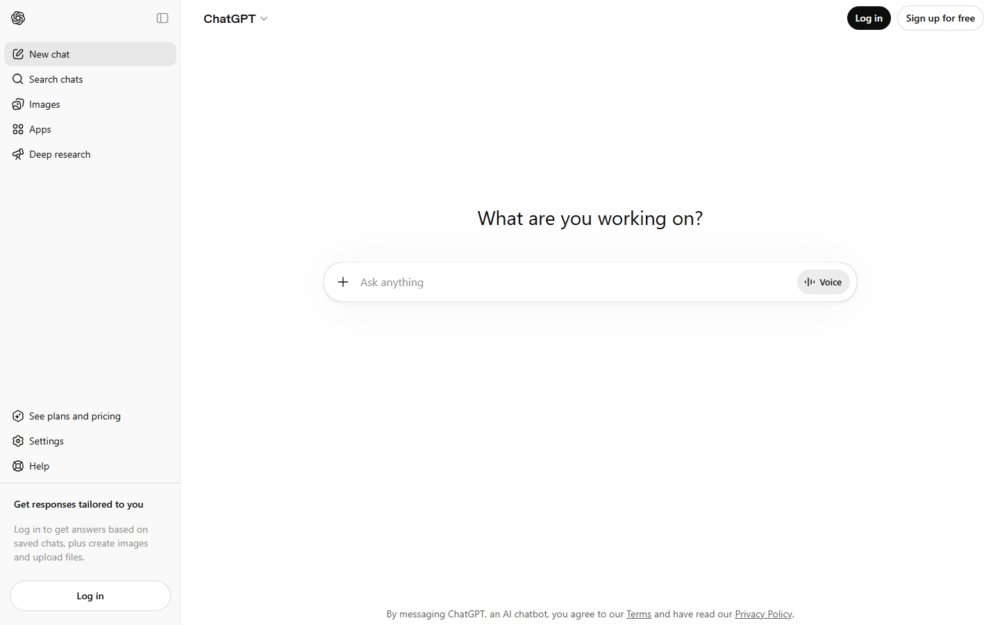
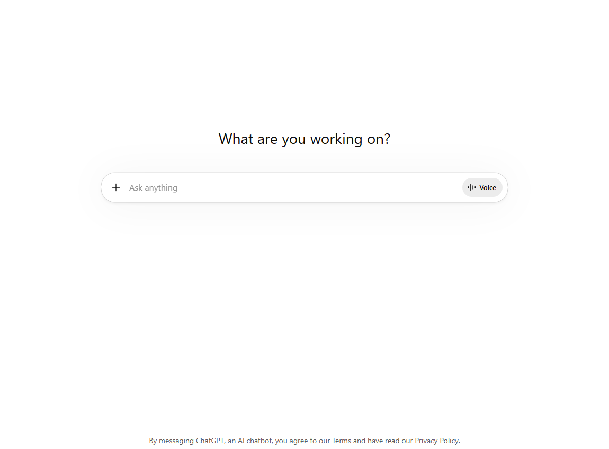
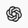
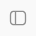
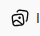
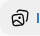

# chatgpt Design System

You are building UI for **chatgpt**. Light-themed, neutral palette, sans-serif typography (OpenAI Sans), compact density on a 4px grid.

## Visual Reference

**IMPORTANT**: Study ALL screenshots below before writing any UI. Match colors, typography, spacing, layout, and motion exactly as shown.

### Homepage



### Scroll Journey (Cinematic Visual States)

> These screenshots capture the website at different scroll depths. The design changes dramatically as you scroll — each frame shows a different cinematic state. Replicate these exact visual transitions.

#### 0% — Hero / Above the fold


#### 17% — Mid-page at 17% scroll


#### 33% — Mid-page at 33% scroll


#### 50% — Mid-page at 50% scroll


#### 67% — Mid-page at 67% scroll


#### 83% — Mid-page at 83% scroll


#### 100% — Footer / End of page


> Read `references/DESIGN.md` for full token details. Read `references/ANIMATIONS.md` for motion specs. Read `references/LAYOUT.md` for layout structure. Read `references/COMPONENTS.md` for component patterns.

## Ultra Reference Files

This package includes extended documentation. **Read these files before implementing:**

| File | Contents |
|------|----------|
| `references/DESIGN.md` | Full design system tokens, colors, typography, spacing |
| `references/VISUAL_GUIDE.md` | **START HERE** — Master visual guide with all screenshots embedded |
| `references/ANIMATIONS.md` | CSS keyframes, scroll triggers, motion library stack, video specs |
| `references/LAYOUT.md` | Flex/grid containers, page structure, spacing relationships |
| `references/COMPONENTS.md` | DOM component patterns, HTML structure, class fingerprints |
| `references/INTERACTIONS.md` | Hover/focus states with before/after style diffs |
| `screens/scroll/` | 7 scroll journey screenshots showing cinematic states |

### Animation Stack Detected

- **Web Animations API (1 active)** — animation

## Design Philosophy

- **Layered depth** — use shadow tokens to create a sense of physical layering. Each elevation level has a specific shadow.
- **Solid colors only** — no gradients anywhere. Every surface is a single flat color.
- **Single typeface** — OpenAI Sans carries all text. Hierarchy comes from size, weight, and color — never font mixing.
- **compact density** — 4px base grid. Every dimension is a multiple of 4.
- **neutral palette** — the color temperature runs neutral, matching the sans-serif typography.
- **Minimal motion** — prefer instant state changes. Only use transitions for loading and page transitions.

## Color System

### Core Palette

| Role | Token | Hex | Use |
|------|-------|-----|-----|
| Background | `--background` | `#ffffff` | Page/app background |
| Surface | `--surface` | `#e8e8e8` | Cards, panels, modals |
| Text Primary | `--text-primary` | `#0d0d0d` | Headings, body text |
| Text Muted | `--text-muted` | `#8f8f8f` | Captions, placeholders |
| Border | `--border` | `#5d5d5d` | Dividers, card borders |

### Extended Palette

- `#000000` — Deep background layer or shadow color
- `#9b9b9b`

### CSS Variable Tokens

```css
--bg-primary: #fff;
--bg-primary-inverted: #000;
--bg-secondary: #e8e8e8;
--bg-secondary-surface: #f9f9f9;
--bg-elevated-primary: #fff;
--bg-elevated-secondary: #f9f9f9;
--bg-accent-static: var(--blue-400);
--border-default: #0d0d0d1a;
--border-heavy: #0d0d0d26;
--border-light: #0d0d0d0d;
--border-extra-light: var(--border-light);
--border-status-warning: var(--orange-50);
--border-status-error: var(--red-50);
--text-primary: #0d0d0d;
--text-secondary: #5d5d5d;
--text-accent: var(--blue-200);
--icon-primary: #0d0d0d;
--icon-secondary: #5d5d5d;
--icon-accent: var(--blue-400);
--interactive-bg-primary-default: #0d0d0d;
```

## Typography

### Font Stack

- **OpenAI Sans** — Heading 1, Heading 2, Heading 3, Body, Caption

### Type Scale

| Role | Family | Size | Weight |
|------|--------|------|--------|
| Heading 1 | OpenAI Sans | 48px / 3rem | 700 |
| Heading 2 | OpenAI Sans | 32px / 2rem | 600 |
| Heading 3 | OpenAI Sans | 24px / 1.5rem | 600 |
| Body | OpenAI Sans | 16px / 1rem | 400 |
| Caption | OpenAI Sans | 12px / 0.75rem | 400 |

### Typography Rules

- All text uses **OpenAI Sans** — never add another font family
- Max 3-4 font sizes per screen
- Headings: weight 600-700, body: weight 400
- Use color and opacity for text hierarchy, not additional font sizes
- Line height: 1.5 for body, 1.2 for headings

## Spacing & Layout

### Base Grid: 4px

Every dimension (margin, padding, gap, width, height) must be a multiple of **4px**.

### Spacing Scale

`4, 6, 8, 10, 12, 16, 20, 24, 40, 60, 64` px

### Spacing as Meaning

| Spacing | Use |
|---------|-----|
| 4-8px | Tight: related items (icon + label, avatar + name) |
| 12-16px | Medium: between groups within a section |
| 24-32px | Wide: between distinct sections |
| 48px+ | Vast: major page section breaks |

### Border Radius

Scale: `8px, 10px, 16px, 28px`
Default: `16px`

## Component Patterns

### Card

```css
.card {
  background: #e8e8e8;
  border: 1px solid #5d5d5d;
  border-radius: 16px;
  padding: 16px;
  box-shadow: rgba(0, 0, 0, 0) 0px 1px 0px 0px;
}
```

```html
<div class="card">
  <h3>Card Title</h3>
  <p>Card content goes here.</p>
</div>
```

### Button

```css
/* Primary */
.btn-primary {
  background: #cccccc;
  color: #0d0d0d;
  border-radius: 16px;
  padding: 8px 16px;
  font-weight: 500;
  transition: opacity 150ms ease;
}
.btn-primary:hover { opacity: 0.9; }

/* Ghost */
.btn-ghost {
  background: transparent;
  border: 1px solid #5d5d5d;
  color: #0d0d0d;
  border-radius: 16px;
  padding: 8px 16px;
}
```

```html
<button class="btn-primary">Get Started</button>
<button class="btn-ghost">Learn More</button>
```

### Input

```css
.input {
  background: #ffffff;
  border: 1px solid #5d5d5d;
  border-radius: 16px;
  padding: 8px 12px;
  color: #0d0d0d;
  font-size: 14px;
}
.input:focus { border-color: var(--accent); outline: none; }
```

```html
<input class="input" type="text" placeholder="Search..." />
```

### Badge / Chip

```css
.badge {
  display: inline-flex;
  align-items: center;
  padding: 4px 8px;
  border-radius: 9999px;
  font-size: 12px;
  font-weight: 500;
  background: #e8e8e8;
  color: #8f8f8f;
}
```

```html
<span class="badge">New</span>
<span class="badge">Beta</span>
```

### Modal / Dialog

```css
.modal-backdrop { background: rgba(0, 0, 0, 0.6); }
.modal {
  background: #e8e8e8;
  border: 1px solid #5d5d5d;
  border-radius: 28px;
  padding: 24px;
  max-width: 480px;
  width: 90vw;
  box-shadow: rgba(0, 0, 0, 0) 0px 0px 0px 0px, rgba(0, 0, 0, 0) 0px 0px 0px 0px, rgba(0, 0, 0, 0) 0px 0px 0px 0px, rgba(0, 0, 0, 0) 0px 0px 0px 0px, rgba(0, 0, 0, 0.04) 0px 4px 4px 0px, rgba(0, 0, 0, 0.04) 0px 4px 80px 8px, rgba(0, 0, 0, 0.62) 0px 0px 1px 0px;
}
```

```html
<div class="modal-backdrop">
  <div class="modal">
    <h2>Dialog Title</h2>
    <p>Dialog content.</p>
    <button class="btn-primary">Confirm</button>
    <button class="btn-ghost">Cancel</button>
  </div>
</div>
```

### Table

```css
.table { width: 100%; border-collapse: collapse; }
.table th {
  text-align: left;
  padding: 8px 12px;
  font-weight: 500;
  font-size: 12px;
  color: #8f8f8f;
  text-transform: uppercase;
  letter-spacing: 0.05em;
  border-bottom: 1px solid #5d5d5d;
}
.table td {
  padding: 12px;
  border-bottom: 1px solid #5d5d5d;
}
```

```html
<table class="table">
  <thead><tr><th>Name</th><th>Status</th><th>Date</th></tr></thead>
  <tbody>
    <tr><td>Item One</td><td>Active</td><td>Jan 1</td></tr>
    <tr><td>Item Two</td><td>Pending</td><td>Jan 2</td></tr>
  </tbody>
</table>
```

### Navigation

```css
.nav {
  display: flex;
  align-items: center;
  gap: 8px;
  padding: 12px 16px;
  border-bottom: 1px solid #5d5d5d;
}
.nav-link {
  color: #8f8f8f;
  padding: 8px 12px;
  border-radius: 16px;
  transition: color 150ms;
}
.nav-link:hover { color: #0d0d0d; }
```

```html
<nav class="nav">
  <a href="/" class="nav-link active">Home</a>
  <a href="/about" class="nav-link">About</a>
  <a href="/pricing" class="nav-link">Pricing</a>
  <button class="btn-primary" style="margin-left: auto">Get Started</button>
</nav>
```

## Animation & Motion

This project uses **subtle motion**. Transitions smooth state changes without calling attention.

### Motion Guidelines

- **Duration:** 150-300ms for micro-interactions, 300-500ms for page transitions
- **Easing:** `ease-out` for enters, `ease-in` for exits
- **Direction:** Elements enter from bottom/right, exit to top/left
- **Reduced motion:** Always respect `prefers-reduced-motion` — disable animations when set

## Depth & Elevation

### Shadow Tokens

- Subtle: `rgba(0, 0, 0, 0) 0px 1px 0px 0px`
- Subtle: `rgba(0, 0, 0, 0) 0px 0px 0px 0px, rgba(0, 0, 0, 0) 0px 0px 0px 0px, rgba(0, 0, 0, 0) 0px 0px 0px 0px, rgb(13, 13, 13) 0px 0px 0px 0px, rgba(0, 0, 0, 0) 0px 0px 0px 0px`
- Overlay (modals, dialogs): `rgba(0, 0, 0, 0) 0px 0px 0px 0px, rgba(0, 0, 0, 0) 0px 0px 0px 0px, rgba(0, 0, 0, 0) 0px 0px 0px 0px, rgba(0, 0, 0, 0) 0px 0px 0px 0px, rgba(0, 0, 0, 0.04) 0px 4px 4px 0px, rgba(0, 0, 0, 0.04) 0px 4px 80px 8px, rgba(0, 0, 0, 0.62) 0px 0px 1px 0px`

## Anti-Patterns (Never Do)

- **No gradients** — solid colors only, everywhere
- **No blur effects** — no backdrop-blur, no filter: blur()
- **No zebra striping** — tables and lists use borders for separation
- **No invented colors** — every hex value must come from the palette above
- **No arbitrary spacing** — every dimension is a multiple of 4px
- **No extra fonts** — only OpenAI Sans are allowed
- **No arbitrary border-radius** — use the scale: 8px, 10px, 16px, 28px
- **No opacity for disabled states** — use muted colors instead
- **No pill shapes** — this design doesn't use rounded-full / 9999px radius

## Workflow

1. **Read** `references/DESIGN.md` before writing any UI code
2. **Pick colors** from the Color System section — never invent new ones
3. **Set typography** — OpenAI Sans only, using the type scale
4. **Build layout** on the 4px grid — check every margin, padding, gap
5. **Match components** to patterns above before creating new ones
6. **Apply elevation** — use shadow tokens
7. **Validate** — every value traces back to a design token. No magic numbers.

## Brand Spec

- **Site URL:** `https://chatgpt.com`
- **Brand typeface:** OpenAI Sans

## Quick Reference

```
Background:     #ffffff
Surface:        #e8e8e8
Text:           #0d0d0d / #8f8f8f
Accent:         (not extracted)
Border:         #5d5d5d
Font:           OpenAI Sans
Spacing:        4px grid
Radius:         16px
Components:     0 detected
```

## When to Trigger

Activate this skill when:
- Creating new components, pages, or visual elements for chatgpt
- Writing CSS, Tailwind classes, styled-components, or inline styles
- Building page layouts, templates, or responsive designs
- Reviewing UI code for design consistency
- The user mentions "chatgpt" design, style, UI, or theme
- Generating mockups, wireframes, or visual prototypes

---

# Full Reference Files

> Every output file is embedded below. Claude has full design system context from /skills alone.

## Design System Tokens (DESIGN.md)

# chatgpt DESIGN.md

> Auto-generated design system — reverse-engineered via static analysis by skillui.
> Frameworks: None detected
> Colors: 7 · Fonts: 1 · Components: 0
> Icon library: not detected · State: not detected
> Primary theme: light · Dark mode toggle: no · Motion: none

## Visual Reference

**Match this design exactly** — study colors, fonts, spacing, and component shapes before writing any UI code.


---

## 1. Visual Theme & Atmosphere

This is a **light-themed** interface with a neutral, approachable feel. The light background emphasizes content clarity. Typography uses **OpenAI Sans** throughout — a clean, modern choice that maintains consistency. Spacing follows a **4px base grid** (compact density), with scale: 4, 6, 8, 10, 12, 16, 20, 24px.

---

## 2. Color Palette & Roles

| Token | Hex | Role | Use |
|---|---|---|---|
| background | `#ffffff` | background | Page background, darkest surface |
| surface | `#e8e8e8` | surface | Card and panel backgrounds |
| text-primary | `#0d0d0d` | text-primary | Headings and body text |
| text-muted | `#8f8f8f` | text-muted | Captions, placeholders, secondary info |
| border | `#5d5d5d` | border | Dividers, card borders, outlines |
| unknown | `#000000` | unknown | Palette color |
| unknown | `#9b9b9b` | unknown | Palette color |

### CSS Variable Tokens

```css
--bg-primary: #fff;
--bg-primary-inverted: #000;
--bg-secondary: #e8e8e8;
--bg-secondary-surface: #f9f9f9;
--bg-elevated-primary: #fff;
--bg-elevated-secondary: #f9f9f9;
--bg-accent-static: var(--blue-400);
--border-default: #0d0d0d1a;
--border-heavy: #0d0d0d26;
--border-light: #0d0d0d0d;
--border-extra-light: var(--border-light);
--border-status-warning: var(--orange-50);
--border-status-error: var(--red-50);
--text-primary: #0d0d0d;
--text-secondary: #5d5d5d;
--text-accent: var(--blue-200);
--icon-primary: #0d0d0d;
--icon-secondary: #5d5d5d;
--icon-accent: var(--blue-400);
--interactive-bg-primary-default: #0d0d0d;
```


---

## 3. Typography Rules

**Font Stack:**
- **OpenAI Sans** — Heading 1, Heading 2, Heading 3, Body, Caption

| Role | Font | Size | Weight |
|---|---|---|---|
| Heading 1 | OpenAI Sans | 48px / 3rem | 700 |
| Heading 2 | OpenAI Sans | 32px / 2rem | 600 |
| Heading 3 | OpenAI Sans | 24px / 1.5rem | 600 |
| Body | OpenAI Sans | 16px / 1rem | 400 |
| Caption | OpenAI Sans | 12px / 0.75rem | 400 |

**Typographic Rules:**
- Use **OpenAI Sans** for all text — do not mix font families
- Maintain consistent hierarchy: no more than 3-4 font sizes per screen
- Headings use bold (600-700), body uses regular (400)
- Line height: 1.5 for body text, 1.2 for headings
- Use color and opacity for secondary hierarchy, not additional font sizes


---

## 4. Component Stylings

No components detected. Scan `src/components/` or `components/` to populate this section.

---

## 5. Layout Principles

- **Base spacing unit:** 4px
- **Spacing scale:** 4, 6, 8, 10, 12, 16, 20, 24, 40, 60, 64
- **Border radius:** 8px, 10px, 16px, 28px

**Spacing as Meaning:**
| Spacing | Use |
|---|---|
| 4-8px | Tight: related items within a group |
| 12-16px | Medium: between groups |
| 24-32px | Wide: between sections |
| 48px+ | Vast: major section breaks |


---

## 6. Depth & Elevation

### Flat — subtle depth hints

- `rgba(0, 0, 0, 0) 0px 1px 0px 0px`
- `rgba(0, 0, 0, 0) 0px 0px 0px 0px, rgba(0, 0, 0, 0) 0px 0px 0px 0px, rgba(0, 0, 0, 0) 0px 0px 0px 0px, rgb(13, 13, 13) 0px 0px 0px 0px, rgba(0, 0, 0, 0) 0px 0px 0px 0px`

### Overlay — full-screen overlays, top-level dialogs

- `rgba(0, 0, 0, 0) 0px 0px 0px 0px, rgba(0, 0, 0, 0) 0px 0px 0px 0px, rgba(0, 0, 0, 0) 0px 0px 0px 0px, rgba(0, 0, 0, 0) 0px 0px 0px 0px, rgba(0, 0, 0, 0.04) 0px 4px 4px 0px, rgba(0, 0, 0, 0.04) 0px 4px 80px 8px, rgba(0, 0, 0, 0.62) 0px 0px 1px 0px`


---

## 8. Do's and Don'ts

### Do's

- Use `#ffffff` as the primary page background
- Use **OpenAI Sans** for all UI text
- Follow the **4px** spacing grid for all margins, padding, and gaps
- Use the defined shadow tokens for elevation — see Section 6
- Use border-radius from the scale: 8px, 10px, 16px, 28px

### Don'ts

- Don't introduce colors outside this palette — extend the design tokens first
- Don't mix font families — use OpenAI Sans consistently
- Don't use arbitrary spacing values — stick to multiples of 4px
- Don't create custom box-shadow values outside the system tokens
- Don't use gradients — the design uses solid colors only
- Don't use arbitrary border-radius values — pick from the defined scale
- Don't use backdrop-blur or blur effects

### Anti-Patterns (detected from codebase)

- No gradient backgrounds
- No blur or backdrop-blur effects
- No zebra striping on tables/lists


---

## 9. Responsive Behavior

No breakpoints detected. Consider adding responsive breakpoints to the design system.

---

## 10. Agent Prompt Guide

Use these as starting points when building new UI:

### Build a Card

```
Background: #e8e8e8
Border: 1px solid #5d5d5d
Radius: 16px
Padding: 16px
Font: OpenAI Sans
Use shadow tokens from Section 6.
```

### Build a Button

```
Primary: bg var(--accent), text white
Ghost: bg transparent, border #5d5d5d
Padding: 8px 16px
Radius: 16px
Hover: opacity 0.9 or lighter shade
Focus: ring with var(--accent)
```

### Build a Page Layout

```
Background: #ffffff
Max-width: 1280px, centered
Grid: 4px base
Responsive: mobile-first, breakpoints from Section 9
```

### Build a Stats Card

```
Surface: #e8e8e8
Label: #8f8f8f (muted, 12px, uppercase)
Value: #0d0d0d (primary, 24-32px, bold)
Status: use success/warning/danger from Section 2
```

### Build a Form

```
Input bg: #ffffff
Input border: 1px solid #5d5d5d
Focus: border-color var(--accent)
Label: #8f8f8f 12px
Spacing: 16px between fields
Radius: 16px
```

### General Component

```
1. Read DESIGN.md Sections 2-6 for tokens
2. Colors: only from palette
3. Font: OpenAI Sans, type scale from Section 3
4. Spacing: 4px grid
5. Components: match patterns from Section 4
6. Elevation: shadow tokens
```

## Visual Guide — Screenshots (VISUAL_GUIDE.md)

# chatgpt — Visual Guide

> Master visual reference. Study every screenshot carefully before implementing any UI.
> Match colors, layout, typography, spacing, and motion states exactly.

**Motion Stack:** **Web Animations API (1 active)**

## Scroll Journey

The page has cinematic scroll animations. Each screenshot below shows the exact visual state at that scroll depth.
**Replicate these transitions precisely** — the design changes dramatically as you scroll.

### Hero — Above the fold

*Scroll position: 0px of 900px total*


### 17% scroll depth

*Scroll position: 0px of 900px total*


### 33% scroll depth

*Scroll position: 0px of 900px total*


### 50% scroll depth

*Scroll position: 0px of 900px total*


### 67% scroll depth

*Scroll position: 0px of 900px total*


### 83% scroll depth

*Scroll position: 0px of 900px total*


### Footer — End of page

*Scroll position: 0px of 900px total*


## Full Page Screenshots

### ChatGPT

*URL: `https://chatgpt.com`*


## Section Screenshots

Clipped sections showing individual components in context.

### Section 1 — `main > div`

*1150×848px*


## Animations & Motion (ANIMATIONS.md)

# Animation Reference

> Cinematic motion design extracted from live DOM. Follow these specs exactly to recreate the experience.

## Motion Technology Stack

| Library | Type | Notes |
|---------|------|-------|
| **Web Animations API (1 active)** | animation |  |

## Scroll Journey

The page is **900px** tall. Each frame below shows what the user sees at that scroll depth.

> **Use these screenshots to understand WHAT animates, WHEN it animates, and HOW it moves.**

### 0% — Top / Hero
Scroll position: 0px


### 17% — Opening Section
Scroll position: 0px


### 33% — First Feature Section
Scroll position: 0px


### 50% — Mid-Page
Scroll position: 0px


### 67% — Lower Content
Scroll position: 0px


### 83% — Near Footer
Scroll position: 0px


### 100% — Bottom / Footer
Scroll position: 0px


## Scroll Animation Patterns

| Pattern | Library | Element Count | Duration | Delay | Easing |
|---------|---------|---------------|----------|-------|--------|
| parallax / sticky scroll | CSS | 7 | — | — | — |

### CSS Implementation

## CSS Keyframes (110 extracted)

### `@keyframes pulseSize`

Duration: `1.25s` · Easing: `ease-in-out` · Delay: `0s` · Iteration: `infinite` · Fill: `none`

Used by: `.pulse > :not(ol, ul, pre, div):last-child::after, .pulse > pre:last-child code:`, `.result-thinking p:last-child::after`

```css
@keyframes pulseSize {
  0%, 100% {
    transform: scale(1);
  }
  50% {
    transform: scale(1.25);
  }
}
```

> Transform/motion animation

### `@keyframes pulseSize`

Duration: `1.25s` · Easing: `ease-in-out` · Delay: `0s` · Iteration: `infinite` · Fill: `none`

Used by: `.pulse > :not(ol, ul, pre, div):last-child::after, .pulse > pre:last-child code:`, `.result-thinking p:last-child::after`

```css
@keyframes pulseSize {
  0%, 100% {
    transform: scale(1);
  }
  50% {
    transform: scale(1.25);
  }
}
```

> Transform/motion animation

### `@keyframes toast-open`

Duration: `0.24s` · Easing: `cubic-bezier(0.175, 0.885, 0.32, 1)` · Delay: `0s` · Iteration: `1` · Fill: `both`

Used by: `.toast-root[data-state="entering"]`

```css
@keyframes toast-open {
  0% {
    opacity: 0;
    transform: translateY(-100%);
  }
  100% {
    opacity: 1;
    transform: translateY(0px);
  }
}
```

> Fade + motion enter animation

### `@keyframes toast-close`

Duration: `0.12s` · Easing: `cubic-bezier(0.4, 0, 1, 1)` · Delay: `0s` · Iteration: `1` · Fill: `both`

Used by: `.toast-root[data-state="exiting"]`

```css
@keyframes toast-close {
  0% {
    opacity: 1;
  }
  100% {
    opacity: 0;
  }
}
```

> Opacity fade

### `@keyframes icon-shimmer`

Duration: `5s` · Easing: `cubic-bezier(0.2, 0.44, 0.38, 1.02)` · Delay: `0s` · Iteration: `infinite` · Fill: `none`

Used by: `.icon-shimmer`

```css
@keyframes icon-shimmer {
  0% {
    -webkit-mask-position-x: 100%;
    -webkit-mask-position-y: center;
  }
  20% {
    -webkit-mask-position-x: 0px;
    -webkit-mask-position-y: center;
  }
  100% {
    -webkit-mask-position-x: 0px;
    -webkit-mask-position-y: center;
  }
}
```

### `@keyframes loading-results-shimmer`

Duration: `3s` · Easing: `linear` · Delay: `0s` · Iteration: `infinite` · Fill: `none`

Used by: `.loading-results-shimmer`

```css
@keyframes loading-results-shimmer {
  0% {
    background-position-x: -1000px;
    background-position-y: 0px;
  }
  100% {
    background-position-x: 1000px;
    background-position-y: 0px;
  }
}
```

> Background color/gradient shift · Background position (shimmer/scroll)

### `@keyframes scalePulse`

Duration: `3.5s` · Easing: `ease-in-out` · Delay: `0s` · Iteration: `infinite` · Fill: `none`

Used by: `.bg-scale-pulse`

```css
@keyframes scalePulse {
  0%, 100% {
    filter: blur();
    transform: scale(1);
  }
  50% {
    filter: blur(8px);
    transform: scale(1.1);
  }
}
```

> Transform/motion animation · Filter effect (blur/brightness)

### `@keyframes diagonalSweep`

Duration: `4s` · Easing: `ease-out` · Delay: `0s` · Iteration: `infinite` · Fill: `none`

Used by: `.diagonal-sweep-gradient`

```css
@keyframes diagonalSweep {
  0% {
    transform: translate(-100%, -100%);
  }
  100% {
    transform: translate(100%, 100%);
  }
}
```

> Transform/motion animation

### `@keyframes sR_mOW_places-sidebar-enter`

Used by: `.sR_mOW_places-overlay-transition::view-transition-new(sR_mOW_business-list-cont`

```css
@keyframes sR_mOW_places-sidebar-enter {
  0% {
    opacity: 0;
  }
  100% {
    opacity: 1;
  }
}
```

> Opacity fade

### `@keyframes sR_mOW_places-sidebar-exit`

Used by: `.sR_mOW_places-overlay-transition::view-transition-old(sR_mOW_business-list-cont`

```css
@keyframes sR_mOW_places-sidebar-exit {
  0% {
    opacity: 1;
  }
  100% {
    opacity: 0;
  }
}
```

> Opacity fade

### `@keyframes sR_mOW_pinnedOldFastFade`

Duration: `0.1s` · Easing: `var(--spring-fast)`

Used by: `.sR_mOW_pinned-widget::view-transition-old(sR_mOW_pinned-kanzi-widget)`

```css
@keyframes sR_mOW_pinnedOldFastFade {
  0% {
    opacity: 1;
  }
  20% {
    opacity: 0;
  }
  100% {
    opacity: 0;
  }
}
```

> Opacity fade

### `@keyframes mapboxgl-spin`

Duration: `2s` · Easing: `linear` · Delay: `0s` · Iteration: `infinite` · Fill: `none`

Used by: `.mapboxgl-ctrl button.mapboxgl-ctrl-geolocate.mapboxgl-ctrl-geolocate-waiting .m`

```css
@keyframes mapboxgl-spin {
  0% {
    transform: rotate(0deg);
  }
  100% {
    transform: rotate(1turn);
  }
}
```

> Transform/motion animation

### `@keyframes mapboxgl-user-location-dot-pulse`

Duration: `2s` · Easing: `ease` · Delay: `0s` · Iteration: `infinite` · Fill: `none`

Used by: `.mapboxgl-user-location-dot::before`

```css
@keyframes mapboxgl-user-location-dot-pulse {
  0% {
    opacity: 1;
    transform: scale(1);
  }
  70% {
    opacity: 0;
    transform: scale(3);
  }
  100% {
    opacity: 0;
    transform: scale(1);
  }
}
```

> Fade + motion enter animation

### `@keyframes swiper-preloader-spin`

Duration: `1s` · Easing: `linear` · Delay: `0s` · Iteration: `infinite` · Fill: `none`

Used by: `:is(.swiper:not(.swiper-watch-progress), .swiper-watch-progress .swiper-slide-vi`

```css
@keyframes swiper-preloader-spin {
  0% {
    transform: rotate(0deg);
  }
  100% {
    transform: rotate(360deg);
  }
}
```

> Transform/motion animation

### `@keyframes bgaZlG_businessTooltipIn`

Duration: `0.18s` · Easing: `ease-out` · Delay: `0s` · Iteration: `1` · Fill: `both`

Used by: `.bgaZlG_tooltipOpen`

```css
@keyframes bgaZlG_businessTooltipIn {
  0% {
    opacity: 0;
    transform: scale(0.9);
  }
  100% {
    opacity: 1;
    transform: scale(1);
  }
}
```

> Fade + motion enter animation

### `@keyframes bgaZlG_businessTooltipOut`

Duration: `0.14s` · Easing: `ease-in` · Delay: `0s` · Iteration: `1` · Fill: `both`

Used by: `.bgaZlG_tooltipClosing`

```css
@keyframes bgaZlG_businessTooltipOut {
  0% {
    opacity: 1;
    transform: scale(1);
  }
  100% {
    opacity: 0;
    transform: scale(0.9);
  }
}
```

> Fade + motion enter animation

### `@keyframes BqefNq_userMarkerPulse`

Duration: `1.8s` · Easing: `cubic-bezier(0.4, 0, 0.6, 1)` · Delay: `0s` · Iteration: `infinite` · Fill: `none`

Used by: `.BqefNq_userMarkerPulse`

```css
@keyframes BqefNq_userMarkerPulse {
  0%, 100% {
    transform: scale(1);
  }
  50% {
    transform: scale(1.1);
  }
}
```

> Transform/motion animation

### `@keyframes _ephxG_Shimmer`

Duration: `2s` · Easing: `ease` · Delay: `0s` · Iteration: `infinite` · Fill: `none`

Used by: `._ephxG_ShimmerText[data-active]`

```css
@keyframes _ephxG_Shimmer {
  0% {
  }
  100% {
  }
}
```

> Background color/gradient shift · Background position (shimmer/scroll)

### `@keyframes QKycbG_fade`

Duration: `0.4s` · Easing: `ease` · Delay: `50ms` · Iteration: `1` · Fill: `forwards`

Used by: `.QKycbG_markdown.markdown .katex-display`

```css
@keyframes QKycbG_fade {
  0% {
    opacity: 0;
  }
  100% {
    opacity: 1;
  }
}
```

> Opacity fade

### `@keyframes sPZ93q_add-top-shadow`

Duration: `auto` · Easing: `linear` · Delay: `0s` · Iteration: `1` · Fill: `both`

Used by: `.sPZ93q_leadingBar`

```css
@keyframes sPZ93q_add-top-shadow {
  0% {
    box-shadow: rgba(0, 0, 0, 0) 0px 1px;
  }
  0.1%, 100% {
    box-shadow: 0 1px 0 var(--border-sharp);
  }
}
```

> Shadow pulse/glow effect

### `@keyframes sPZ93q_add-bottom-shadow`

Duration: `auto` · Easing: `linear` · Delay: `0s` · Iteration: `1` · Fill: `both`

Used by: `.sPZ93q_trailingBar`

```css
@keyframes sPZ93q_add-bottom-shadow {
  0%, 99.9% {
    box-shadow: 0 -1px 0 var(--border-sharp);
  }
  100% {
    box-shadow: rgba(0, 0, 0, 0) 0px -1px;
  }
}
```

> Shadow pulse/glow effect

### `@keyframes toast-open`

Duration: `0.24s` · Easing: `cubic-bezier(0.175, 0.885, 0.32, 1)` · Delay: `0s` · Iteration: `1` · Fill: `both`

Used by: `.toast-root[data-state="entering"]`

```css
@keyframes toast-open {
  0% {
    opacity: 0;
    transform: translateY(-100%);
  }
  100% {
    opacity: 1;
    transform: translateY(0px);
  }
}
```

> Fade + motion enter animation

### `@keyframes toast-close`

Duration: `0.12s` · Easing: `cubic-bezier(0.4, 0, 1, 1)` · Delay: `0s` · Iteration: `1` · Fill: `both`

Used by: `.toast-root[data-state="exiting"]`

```css
@keyframes toast-close {
  0% {
    opacity: 1;
  }
  100% {
    opacity: 0;
  }
}
```

> Opacity fade

### `@keyframes icon-shimmer`

Duration: `5s` · Easing: `cubic-bezier(0.2, 0.44, 0.38, 1.02)` · Delay: `0s` · Iteration: `infinite` · Fill: `none`

Used by: `.icon-shimmer`

```css
@keyframes icon-shimmer {
  0% {
    -webkit-mask-position-x: 100%;
    -webkit-mask-position-y: center;
  }
  20% {
    -webkit-mask-position-x: 0px;
    -webkit-mask-position-y: center;
  }
  100% {
    -webkit-mask-position-x: 0px;
    -webkit-mask-position-y: center;
  }
}
```

### `@keyframes loading-results-shimmer`

Duration: `3s` · Easing: `linear` · Delay: `0s` · Iteration: `infinite` · Fill: `none`

Used by: `.loading-results-shimmer`

```css
@keyframes loading-results-shimmer {
  0% {
    background-position-x: -1000px;
    background-position-y: 0px;
  }
  100% {
    background-position-x: 1000px;
    background-position-y: 0px;
  }
}
```

> Background color/gradient shift · Background position (shimmer/scroll)

### `@keyframes scalePulse`

Duration: `3.5s` · Easing: `ease-in-out` · Delay: `0s` · Iteration: `infinite` · Fill: `none`

Used by: `.bg-scale-pulse`

```css
@keyframes scalePulse {
  0%, 100% {
    filter: blur();
    transform: scale(1);
  }
  50% {
    filter: blur(8px);
    transform: scale(1.1);
  }
}
```

> Transform/motion animation · Filter effect (blur/brightness)

### `@keyframes diagonalSweep`

Duration: `4s` · Easing: `ease-out` · Delay: `0s` · Iteration: `infinite` · Fill: `none`

Used by: `.diagonal-sweep-gradient`

```css
@keyframes diagonalSweep {
  0% {
    transform: translate(-100%, -100%);
  }
  100% {
    transform: translate(100%, 100%);
  }
}
```

> Transform/motion animation

### `@keyframes sR_mOW_places-sidebar-enter`

Used by: `.sR_mOW_places-overlay-transition::view-transition-new(sR_mOW_business-list-cont`

```css
@keyframes sR_mOW_places-sidebar-enter {
  0% {
    opacity: 0;
  }
  100% {
    opacity: 1;
  }
}
```

> Opacity fade

### `@keyframes sR_mOW_places-sidebar-exit`

Used by: `.sR_mOW_places-overlay-transition::view-transition-old(sR_mOW_business-list-cont`

```css
@keyframes sR_mOW_places-sidebar-exit {
  0% {
    opacity: 1;
  }
  100% {
    opacity: 0;
  }
}
```

> Opacity fade

### `@keyframes sR_mOW_pinnedOldFastFade`

Duration: `0.1s` · Easing: `var(--spring-fast)`

Used by: `.sR_mOW_pinned-widget::view-transition-old(sR_mOW_pinned-kanzi-widget)`

```css
@keyframes sR_mOW_pinnedOldFastFade {
  0% {
    opacity: 1;
  }
  20% {
    opacity: 0;
  }
  100% {
    opacity: 0;
  }
}
```

> Opacity fade

### `@keyframes mapboxgl-spin`

Duration: `2s` · Easing: `linear` · Delay: `0s` · Iteration: `infinite` · Fill: `none`

Used by: `.mapboxgl-ctrl button.mapboxgl-ctrl-geolocate.mapboxgl-ctrl-geolocate-waiting .m`

```css
@keyframes mapboxgl-spin {
  0% {
    transform: rotate(0deg);
  }
  100% {
    transform: rotate(1turn);
  }
}
```

> Transform/motion animation

### `@keyframes mapboxgl-user-location-dot-pulse`

Duration: `2s` · Easing: `ease` · Delay: `0s` · Iteration: `infinite` · Fill: `none`

Used by: `.mapboxgl-user-location-dot::before`

```css
@keyframes mapboxgl-user-location-dot-pulse {
  0% {
    opacity: 1;
    transform: scale(1);
  }
  70% {
    opacity: 0;
    transform: scale(3);
  }
  100% {
    opacity: 0;
    transform: scale(1);
  }
}
```

> Fade + motion enter animation

### `@keyframes swiper-preloader-spin`

Duration: `1s` · Easing: `linear` · Delay: `0s` · Iteration: `infinite` · Fill: `none`

Used by: `:is(.swiper:not(.swiper-watch-progress), .swiper-watch-progress .swiper-slide-vi`

```css
@keyframes swiper-preloader-spin {
  0% {
    transform: rotate(0deg);
  }
  100% {
    transform: rotate(360deg);
  }
}
```

> Transform/motion animation

### `@keyframes bgaZlG_businessTooltipIn`

Duration: `0.18s` · Easing: `ease-out` · Delay: `0s` · Iteration: `1` · Fill: `both`

Used by: `.bgaZlG_tooltipOpen`

```css
@keyframes bgaZlG_businessTooltipIn {
  0% {
    opacity: 0;
    transform: scale(0.9);
  }
  100% {
    opacity: 1;
    transform: scale(1);
  }
}
```

> Fade + motion enter animation

### `@keyframes bgaZlG_businessTooltipOut`

Duration: `0.14s` · Easing: `ease-in` · Delay: `0s` · Iteration: `1` · Fill: `both`

Used by: `.bgaZlG_tooltipClosing`

```css
@keyframes bgaZlG_businessTooltipOut {
  0% {
    opacity: 1;
    transform: scale(1);
  }
  100% {
    opacity: 0;
    transform: scale(0.9);
  }
}
```

> Fade + motion enter animation

### `@keyframes BqefNq_userMarkerPulse`

Duration: `1.8s` · Easing: `cubic-bezier(0.4, 0, 0.6, 1)` · Delay: `0s` · Iteration: `infinite` · Fill: `none`

Used by: `.BqefNq_userMarkerPulse`

```css
@keyframes BqefNq_userMarkerPulse {
  0%, 100% {
    transform: scale(1);
  }
  50% {
    transform: scale(1.1);
  }
}
```

> Transform/motion animation

### `@keyframes _ephxG_Shimmer`

Duration: `2s` · Easing: `ease` · Delay: `0s` · Iteration: `infinite` · Fill: `none`

Used by: `._ephxG_ShimmerText[data-active]`

```css
@keyframes _ephxG_Shimmer {
  0% {
  }
  100% {
  }
}
```

> Background color/gradient shift · Background position (shimmer/scroll)

### `@keyframes QKycbG_fade`

Duration: `0.4s` · Easing: `ease` · Delay: `50ms` · Iteration: `1` · Fill: `forwards`

Used by: `.QKycbG_markdown.markdown .katex-display`

```css
@keyframes QKycbG_fade {
  0% {
    opacity: 0;
  }
  100% {
    opacity: 1;
  }
}
```

> Opacity fade

### `@keyframes sPZ93q_add-top-shadow`

Duration: `auto` · Easing: `linear` · Delay: `0s` · Iteration: `1` · Fill: `both`

Used by: `.sPZ93q_leadingBar`

```css
@keyframes sPZ93q_add-top-shadow {
  0% {
    box-shadow: rgba(0, 0, 0, 0) 0px 1px;
  }
  0.1%, 100% {
    box-shadow: 0 1px 0 var(--border-sharp);
  }
}
```

> Shadow pulse/glow effect

### `@keyframes sPZ93q_add-bottom-shadow`

Duration: `auto` · Easing: `linear` · Delay: `0s` · Iteration: `1` · Fill: `both`

Used by: `.sPZ93q_trailingBar`

```css
@keyframes sPZ93q_add-bottom-shadow {
  0%, 99.9% {
    box-shadow: 0 -1px 0 var(--border-sharp);
  }
  100% {
    box-shadow: rgba(0, 0, 0, 0) 0px -1px;
  }
}
```

> Shadow pulse/glow effect

### `@keyframes peek-top-animation`

```css
@keyframes peek-top-animation {
  50% {
    translate: 0px -85px;
  }
  75% {
    translate: 0px -85px;
  }
  100% {
    translate: 0px;
  }
}
```

### `@keyframes peek-top-end-animation`

```css
@keyframes peek-top-end-animation {
  100% {
    translate: 0px;
  }
}
```

### `@keyframes mask-shimmer-offset-move`

```css
@keyframes mask-shimmer-offset-move {
  0% {
    --mask-shimmer-offset: 0%;
  }
  100% {
    --mask-shimmer-offset: 100%;
  }
}
```

### `@keyframes blink`

```css
@keyframes blink {
  100% {
    visibility: hidden;
  }
}
```

### `@keyframes show`

```css
@keyframes show {
  0% {
    opacity: 0;
  }
  100% {
    opacity: 1;
  }
}
```

> Opacity fade

### `@keyframes add-top-shadow`

```css
@keyframes add-top-shadow {
  0% {
    box-shadow: var(--sharp-edge-top-shadow-placeholder);
  }
  0.1%, 100% {
    box-shadow: var(--sharp-edge-top-shadow);
  }
}
```

> Shadow pulse/glow effect

### `@keyframes add-bottom-shadow`

```css
@keyframes add-bottom-shadow {
  0%, 99.9% {
    box-shadow: var(--sharp-edge-bottom-shadow);
  }
  100% {
    box-shadow: var(--sharp-edge-bottom-shadow-placeholder);
  }
}
```

> Shadow pulse/glow effect

### `@keyframes shimmer-skeleton`

```css
@keyframes shimmer-skeleton {
  0% {
    background-position-x: 100%;
    background-position-y: center;
  }
  100% {
    background-position-x: 0%;
    background-position-y: center;
  }
}
```

> Background color/gradient shift · Background position (shimmer/scroll)

### `@keyframes pulse-dot`

```css
@keyframes pulse-dot {
  0% {
    opacity: 0.1;
    scale: 0.7;
  }
  50% {
    transform: scale(var(--pulse-scale,1.3));
    opacity: 1;
  }
  100% {
    opacity: 0;
    transform: scale(0.7);
  }
}
```

> Fade + motion enter animation

### `@keyframes float-sidebar-in`

```css
@keyframes float-sidebar-in {
  0% {
    opacity: 0;
    translate: -60%;
  }
  70% {
    opacity: 1;
  }
  100% {
    translate: 0px;
  }
}
```

> Opacity fade

### `@keyframes float-sidebar-out`

```css
@keyframes float-sidebar-out {
  0% {
    translate: 0px;
  }
  30% {
    opacity: 1;
  }
  100% {
    opacity: 0;
    translate: -60%;
  }
}
```

> Opacity fade

### `@keyframes loading-shimmer`

```css
@keyframes loading-shimmer {
  0% {
  }
  100% {
  }
}
```

> Background color/gradient shift · Background position (shimmer/scroll)

### `@keyframes rotateShine`

```css
@keyframes rotateShine {
  0% {
    opacity: 0;
    transform: rotate(var(--feh-border-glow-start-rotation,0deg)) translate(-50%, -50%);
  }
  68% {
    opacity: 0;
    transform: rotate(var(--feh-border-glow-start-rotation,0deg)) translate(-50%, -50%);
  }
  72% {
    opacity: 1;
  }
  100% {
    opacity: 0;
    transform: rotate(calc(var(--feh-border-glow-start-rotation,0deg) + 360deg)) translate(-50%, -50%);
  }
}
```

> Fade + motion enter animation

### `@keyframes rotateShineContinuous`

```css
@keyframes rotateShineContinuous {
  0% {
    opacity: 1;
    transform: rotate(var(--feh-border-glow-start-rotation,0deg)) translate(-50%, -50%);
  }
  100% {
    opacity: 1;
    transform: rotate(calc(var(--feh-border-glow-start-rotation,0deg) + 360deg)) translate(-50%, -50%);
  }
}
```

> Fade + motion enter animation

### `@keyframes upgrade-button-gleam`

```css
@keyframes upgrade-button-gleam {
  0% {
    opacity: 0;
    transform: translate(-150%) skew(-18deg);
  }
  68% {
    opacity: 0;
    transform: translate(-150%) skew(-18deg);
  }
  72% {
    opacity: 0.6;
  }
  100% {
    opacity: 0;
    transform: translate(150%) skew(-18deg);
  }
}
```

> Fade + motion enter animation

### `@keyframes spin`

```css
@keyframes spin {
  0% {
    transform: rotate(0deg);
  }
  100% {
    transform: rotate(360deg);
  }
}
```

> Transform/motion animation

### `@keyframes pulse`

```css
@keyframes pulse {
  50% {
    opacity: 0.5;
  }
}
```

> Opacity fade

### `@keyframes bounce`

```css
@keyframes bounce {
  0%, 100% {
    animation-timing-function: cubic-bezier(0.8, 0, 1, 1);
    transform: translateY(-25%);
  }
  50% {
    animation-timing-function: cubic-bezier(0, 0, 0.2, 1);
    transform: none;
  }
}
```

> Transform/motion animation

### `@keyframes pulsing`

```css
@keyframes pulsing {
  0% {
    opacity: 1;
    scale: 1;
  }
  50% {
    opacity: 0.9;
    scale: 0.875;
  }
  100% {
    opacity: 1;
    scale: 1;
  }
}
```

> Opacity fade

### `@keyframes slideDownAndFade`

```css
@keyframes slideDownAndFade {
  0% {
    opacity: 0;
    transform: translateY(-1px);
  }
  100% {
    opacity: 1;
    transform: translateY(0px);
  }
}
```

> Fade + motion enter animation

### `@keyframes slideLeftAndFade`

```css
@keyframes slideLeftAndFade {
  0% {
    opacity: 0;
    transform: translate(1px);
  }
  100% {
    opacity: 1;
    transform: translate(0px);
  }
}
```

> Fade + motion enter animation

### `@keyframes contentShow`

```css
@keyframes contentShow {
  0% {
    opacity: 0;
    transform: scale(0.96);
  }
  100% {
    opacity: 1;
    transform: scale(1);
  }
}
```

> Fade + motion enter animation

### `@keyframes alertShow`

```css
@keyframes alertShow {
  0% {
    opacity: 0;
    transform: translate(-50%, -48%) scale(0.96);
  }
  100% {
    opacity: 1;
    transform: translate(-50%, -50%) scale(1);
  }
}
```

> Fade + motion enter animation

### `@keyframes slide-in-right`

```css
@keyframes slide-in-right {
  0% {
    transform: translate(100%);
  }
  100% {
    transform: translate(0px);
  }
}
```

> Transform/motion animation

### `@keyframes slide-out-left`

```css
@keyframes slide-out-left {
  0% {
    transform: translate(0px);
  }
  100% {
    transform: translate(-100%);
  }
}
```

> Transform/motion animation

### `@keyframes slide-in-left`

```css
@keyframes slide-in-left {
  0% {
    transform: translate(-100%);
  }
  100% {
    transform: translate(0px);
  }
}
```

> Transform/motion animation

### `@keyframes slide-out-right`

```css
@keyframes slide-out-right {
  0% {
    transform: translate(0px);
  }
  100% {
    transform: translate(100%);
  }
}
```

> Transform/motion animation

### `@keyframes mkt-slide-anim`

```css
@keyframes mkt-slide-anim {
  0% {
    transform: translate(0px);
  }
  50% {
    left: 0px;
  }
  100% {
    transform: translateX(calc(-100% * var(--to-end-unit,1)));
  }
}
```

> Transform/motion animation

### `@keyframes sR_mOW_slide-up`

```css
@keyframes sR_mOW_slide-up {
  0% {
    opacity: 0;
    translate: 0px 20vw;
  }
}
```

> Opacity fade

### `@keyframes sR_mOW_slide-down`

```css
@keyframes sR_mOW_slide-down {
  100% {
    opacity: 0;
    translate: 0px 20vw;
  }
}
```

> Opacity fade

### `@keyframes sR_mOW_popover-thread-enter`

```css
@keyframes sR_mOW_popover-thread-enter {
  0% {
    opacity: 0;
    transform: scale(0.98);
  }
  100% {
    opacity: 1;
    transform: scale(1);
  }
}
```

> Fade + motion enter animation

### `@keyframes sR_mOW_popover-thread-exit`

```css
@keyframes sR_mOW_popover-thread-exit {
  0% {
    opacity: 1;
    transform: scale(1);
  }
  100% {
    opacity: 0;
    transform: scale(0.98);
  }
}
```

> Fade + motion enter animation

### `@keyframes -fBEMq_user-message-truncation-detect-scroll`

```css
@keyframes -fBEMq_user-message-truncation-detect-scroll {
  0%, 100% {
    --user-message-can-scroll: 1;
  }
}
```

### `@keyframes BZ_Pyq_fade-in`

```css
@keyframes BZ_Pyq_fade-in {
  100% {
    opacity: 1;
  }
}
```

> Opacity fade

### `@keyframes e33vkq_working-dot-wave`

```css
@keyframes e33vkq_working-dot-wave {
  0%, 10%, 100% {
    transform: translateY(0px);
  }
  25% {
    transform: translateY(1.2px);
  }
  55% {
    transform: translateY(-2px);
  }
  70% {
    transform: translateY(0px);
  }
}
```

> Transform/motion animation

### `@keyframes peek-top-animation`

```css
@keyframes peek-top-animation {
  50% {
    translate: 0px -85px;
  }
  75% {
    translate: 0px -85px;
  }
  100% {
    translate: 0px;
  }
}
```

### `@keyframes peek-top-end-animation`

```css
@keyframes peek-top-end-animation {
  100% {
    translate: 0px;
  }
}
```

### `@keyframes mask-shimmer-offset-move`

```css
@keyframes mask-shimmer-offset-move {
  0% {
    --mask-shimmer-offset: 0%;
  }
  100% {
    --mask-shimmer-offset: 100%;
  }
}
```

### `@keyframes blink`

```css
@keyframes blink {
  100% {
    visibility: hidden;
  }
}
```

### `@keyframes show`

```css
@keyframes show {
  0% {
    opacity: 0;
  }
  100% {
    opacity: 1;
  }
}
```

> Opacity fade

### `@keyframes add-top-shadow`

```css
@keyframes add-top-shadow {
  0% {
    box-shadow: var(--sharp-edge-top-shadow-placeholder);
  }
  0.1%, 100% {
    box-shadow: var(--sharp-edge-top-shadow);
  }
}
```

> Shadow pulse/glow effect

### `@keyframes add-bottom-shadow`

```css
@keyframes add-bottom-shadow {
  0%, 99.9% {
    box-shadow: var(--sharp-edge-bottom-shadow);
  }
  100% {
    box-shadow: var(--sharp-edge-bottom-shadow-placeholder);
  }
}
```

> Shadow pulse/glow effect

### `@keyframes shimmer-skeleton`

```css
@keyframes shimmer-skeleton {
  0% {
    background-position-x: 100%;
    background-position-y: center;
  }
  100% {
    background-position-x: 0%;
    background-position-y: center;
  }
}
```

> Background color/gradient shift · Background position (shimmer/scroll)

### `@keyframes pulse-dot`

```css
@keyframes pulse-dot {
  0% {
    opacity: 0.1;
    scale: 0.7;
  }
  50% {
    transform: scale(var(--pulse-scale,1.3));
    opacity: 1;
  }
  100% {
    opacity: 0;
    transform: scale(0.7);
  }
}
```

> Fade + motion enter animation

### `@keyframes float-sidebar-in`

```css
@keyframes float-sidebar-in {
  0% {
    opacity: 0;
    translate: -60%;
  }
  70% {
    opacity: 1;
  }
  100% {
    translate: 0px;
  }
}
```

> Opacity fade

### `@keyframes float-sidebar-out`

```css
@keyframes float-sidebar-out {
  0% {
    translate: 0px;
  }
  30% {
    opacity: 1;
  }
  100% {
    opacity: 0;
    translate: -60%;
  }
}
```

> Opacity fade

### `@keyframes loading-shimmer`

```css
@keyframes loading-shimmer {
  0% {
  }
  100% {
  }
}
```

> Background color/gradient shift · Background position (shimmer/scroll)

### `@keyframes rotateShine`

```css
@keyframes rotateShine {
  0% {
    opacity: 0;
    transform: rotate(var(--feh-border-glow-start-rotation,0deg)) translate(-50%, -50%);
  }
  68% {
    opacity: 0;
    transform: rotate(var(--feh-border-glow-start-rotation,0deg)) translate(-50%, -50%);
  }
  72% {
    opacity: 1;
  }
  100% {
    opacity: 0;
    transform: rotate(calc(var(--feh-border-glow-start-rotation,0deg) + 360deg)) translate(-50%, -50%);
  }
}
```

> Fade + motion enter animation

### `@keyframes rotateShineContinuous`

```css
@keyframes rotateShineContinuous {
  0% {
    opacity: 1;
    transform: rotate(var(--feh-border-glow-start-rotation,0deg)) translate(-50%, -50%);
  }
  100% {
    opacity: 1;
    transform: rotate(calc(var(--feh-border-glow-start-rotation,0deg) + 360deg)) translate(-50%, -50%);
  }
}
```

> Fade + motion enter animation

### `@keyframes upgrade-button-gleam`

```css
@keyframes upgrade-button-gleam {
  0% {
    opacity: 0;
    transform: translate(-150%) skew(-18deg);
  }
  68% {
    opacity: 0;
    transform: translate(-150%) skew(-18deg);
  }
  72% {
    opacity: 0.6;
  }
  100% {
    opacity: 0;
    transform: translate(150%) skew(-18deg);
  }
}
```

> Fade + motion enter animation

### `@keyframes spin`

```css
@keyframes spin {
  0% {
    transform: rotate(0deg);
  }
  100% {
    transform: rotate(360deg);
  }
}
```

> Transform/motion animation

### `@keyframes pulse`

```css
@keyframes pulse {
  50% {
    opacity: 0.5;
  }
}
```

> Opacity fade

### `@keyframes bounce`

```css
@keyframes bounce {
  0%, 100% {
    animation-timing-function: cubic-bezier(0.8, 0, 1, 1);
    transform: translateY(-25%);
  }
  50% {
    animation-timing-function: cubic-bezier(0, 0, 0.2, 1);
    transform: none;
  }
}
```

> Transform/motion animation

### `@keyframes pulsing`

```css
@keyframes pulsing {
  0% {
    opacity: 1;
    scale: 1;
  }
  50% {
    opacity: 0.9;
    scale: 0.875;
  }
  100% {
    opacity: 1;
    scale: 1;
  }
}
```

> Opacity fade

### `@keyframes slideDownAndFade`

```css
@keyframes slideDownAndFade {
  0% {
    opacity: 0;
    transform: translateY(-1px);
  }
  100% {
    opacity: 1;
    transform: translateY(0px);
  }
}
```

> Fade + motion enter animation

### `@keyframes slideLeftAndFade`

```css
@keyframes slideLeftAndFade {
  0% {
    opacity: 0;
    transform: translate(1px);
  }
  100% {
    opacity: 1;
    transform: translate(0px);
  }
}
```

> Fade + motion enter animation

### `@keyframes contentShow`

```css
@keyframes contentShow {
  0% {
    opacity: 0;
    transform: scale(0.96);
  }
  100% {
    opacity: 1;
    transform: scale(1);
  }
}
```

> Fade + motion enter animation

### `@keyframes alertShow`

```css
@keyframes alertShow {
  0% {
    opacity: 0;
    transform: translate(-50%, -48%) scale(0.96);
  }
  100% {
    opacity: 1;
    transform: translate(-50%, -50%) scale(1);
  }
}
```

> Fade + motion enter animation

### `@keyframes slide-in-right`

```css
@keyframes slide-in-right {
  0% {
    transform: translate(100%);
  }
  100% {
    transform: translate(0px);
  }
}
```

> Transform/motion animation

### `@keyframes slide-out-left`

```css
@keyframes slide-out-left {
  0% {
    transform: translate(0px);
  }
  100% {
    transform: translate(-100%);
  }
}
```

> Transform/motion animation

### `@keyframes slide-in-left`

```css
@keyframes slide-in-left {
  0% {
    transform: translate(-100%);
  }
  100% {
    transform: translate(0px);
  }
}
```

> Transform/motion animation

### `@keyframes slide-out-right`

```css
@keyframes slide-out-right {
  0% {
    transform: translate(0px);
  }
  100% {
    transform: translate(100%);
  }
}
```

> Transform/motion animation

### `@keyframes mkt-slide-anim`

```css
@keyframes mkt-slide-anim {
  0% {
    transform: translate(0px);
  }
  50% {
    left: 0px;
  }
  100% {
    transform: translateX(calc(-100% * var(--to-end-unit,1)));
  }
}
```

> Transform/motion animation

### `@keyframes sR_mOW_slide-up`

```css
@keyframes sR_mOW_slide-up {
  0% {
    opacity: 0;
    translate: 0px 20vw;
  }
}
```

> Opacity fade

### `@keyframes sR_mOW_slide-down`

```css
@keyframes sR_mOW_slide-down {
  100% {
    opacity: 0;
    translate: 0px 20vw;
  }
}
```

> Opacity fade

### `@keyframes sR_mOW_popover-thread-enter`

```css
@keyframes sR_mOW_popover-thread-enter {
  0% {
    opacity: 0;
    transform: scale(0.98);
  }
  100% {
    opacity: 1;
    transform: scale(1);
  }
}
```

> Fade + motion enter animation

### `@keyframes sR_mOW_popover-thread-exit`

```css
@keyframes sR_mOW_popover-thread-exit {
  0% {
    opacity: 1;
    transform: scale(1);
  }
  100% {
    opacity: 0;
    transform: scale(0.98);
  }
}
```

> Fade + motion enter animation

### `@keyframes -fBEMq_user-message-truncation-detect-scroll`

```css
@keyframes -fBEMq_user-message-truncation-detect-scroll {
  0%, 100% {
    --user-message-can-scroll: 1;
  }
}
```

### `@keyframes BZ_Pyq_fade-in`

```css
@keyframes BZ_Pyq_fade-in {
  100% {
    opacity: 1;
  }
}
```

> Opacity fade

### `@keyframes e33vkq_working-dot-wave`

```css
@keyframes e33vkq_working-dot-wave {
  0%, 10%, 100% {
    transform: translateY(0px);
  }
  25% {
    transform: translateY(1.2px);
  }
  55% {
    transform: translateY(-2px);
  }
  70% {
    transform: translateY(0px);
  }
}
```

> Transform/motion animation

## Motion Tokens (CSS Variables)

### Duration Tokens

```css
--spring-fast-duration: .667s;
--spring-common-duration: .667s;
--spring-slow-bounce-duration: 1.167s;
--spring-bounce-duration: .833s;
--spring-fast-bounce-duration: 1s;
--easing-spring-elegant-duration: .58171s;
--cot-shimmer-duration: 2s;
--spring-fast-duration: .667s;
--spring-common-duration: .667s;
--spring-slow-bounce-duration: 1.167s;
--spring-bounce-duration: .833s;
--spring-fast-bounce-duration: 1s;
--easing-spring-elegant-duration: .58171s;
--cot-shimmer-duration: 2s;
--default-transition-duration: .15s;
--tw-mask-shimmer-duration: 4s;
```

### Easing Tokens

```css
--ease-in: cubic-bezier(.4, 0, 1, 1);
--default-transition-timing-function: cubic-bezier(.4, 0, .2, 1);
--ease-out: cubic-bezier(0, 0, .2, 1);
--ease-in-out: cubic-bezier(.4, 0, .2, 1);
```

### Delay Tokens

```css
--tw-mask-shimmer-delay: 0s;
```

### Other Tokens

```css
--spring-fast: linear(0, .01942 1.83%, .07956 4.02%, .47488 13.851%, .65981 19.572%, .79653 25.733%, .84834 29.083%, .89048 32.693%, .9246 36.734%, .95081 41.254%, .97012 46.425%, .98361 52.535%, .99665 68.277%, .99988);
--spring-common: linear(0, .00506 1.18%, .02044 2.46%, .08322 5.391%, .46561 17.652%, .63901 24.342%, .76663 31.093%, .85981 38.454%, .89862 42.934%, .92965 47.845%, .95366 53.305%, .97154 59.516%, .99189 74.867%, .9991);
--spring-standard: var(--spring-common);
--spring-slow-bounce: linear(0, .00172 0.51%, .00682 1.03%, .02721 2.12%, .06135 3.29%, .11043 4.58%, .21945 6.911%, .59552 14.171%, .70414 16.612%, .79359 18.962%, .86872 21.362%, .92924 23.822%, .97589 26.373%, 1.01 29.083%, 1.0264 31.043%, 1.03767 33.133%, 1.04411 35.404%, 1.04597 37.944%, 1.04058 42.454%, 1.01119 55.646%, 1.00137 63.716%, .99791 74.127%, .99988);
--spring-bounce: linear(0, .00541 1.29%, .02175 2.68%, .04923 4.19%, .08852 5.861%, .17388 8.851%, .48317 18.732%, .57693 22.162%, .65685 25.503%, .72432 28.793%, .78235 32.163%, .83182 35.664%, .87356 39.354%, .91132 43.714%, .94105 48.455%, .96361 53.705%, .97991 59.676%, .9903 66.247%, .99664 74.237%, .99968 84.358%, 1.00048);
--spring-fast-bounce: linear(0, .00683 1.14%, .02731 2.35%, .11137 5.091%, .59413 15.612%, .78996 20.792%, .92396 25.953%, .97109 28.653%, 1.00624 31.503%, 1.03801 36.154%, 1.0477 41.684%, 1.00242 68.787%, .99921);
--easing-spring-elegant: linear(0 0%, .005927 1%, .022466 2%, .047872 3%, .080554 4%, .119068 5%, .162116 6%, .208536 7.0%, .2573 8%, .3075 9%, .358346 10%, .409157 11%, .45935 12%, .508438 13%, .556014 14.0%, .601751 15%, .645389 16%, .686733 17%, .72564 18%, .762019 19%, .795818 20%, .827026 21%, .855662 22%, .881772 23%, .905423 24%, .926704 25%, .945714 26%, .962568 27%, .977386 28.0%, .990295 29.0%, 1.00143 30%, 1.01091 31%, 1.01888 32%, 1.02547 33%, 1.03079 34%, 1.03498 35%, 1.03816 36%, 1.04042 37%, 1.04189 38%, 1.04266 39%, 1.04283 40%, 1.04247 41%, 1.04168 42%, 1.04052 43%, 1.03907 44%, 1.03737 45%, 1.03549 46%, 1.03348 47%, 1.03138 48%, 1.02922 49%, 1.02704 50%, 1.02486 51%, 1.02272 52%, 1.02063 53%, 1.01861 54%, 1.01667 55.0%, 1.01482 56.0%, 1.01307 57.0%, 1.01142 58.0%, 1.00989 59%, 1.00846 60%, 1.00715 61%, 1.00594 62%, 1.00485 63%, 1.00386 64%, 1.00296 65%, 1.00217 66%, 1.00147 67%, 1.00085 68%, 1.00031 69%, .999849 70%, .999457 71%, .999128 72%, .998858 73%, .99864 74%, .99847 75%, .998342 76%, .998253 77%, .998196 78%, .998169 79%, .998167 80%, .998186 81%, .998224 82%, .998276 83%, .998341 84%, .998415 85%, .998497 86%, .998584 87%, .998675 88%, .998768 89%, .998861 90%, .998954 91%, .999045 92%, .999134 93%, .99922 94%, .999303 95%, .999381 96%, .999455 97%, .999525 98%, .999589 99%, .99965 100%);
--spring-fast: linear(0, .01942 1.83%, .07956 4.02%, .47488 13.851%, .65981 19.572%, .79653 25.733%, .84834 29.083%, .89048 32.693%, .9246 36.734%, .95081 41.254%, .97012 46.425%, .98361 52.535%, .99665 68.277%, .99988);
--spring-common: linear(0, .00506 1.18%, .02044 2.46%, .08322 5.391%, .46561 17.652%, .63901 24.342%, .76663 31.093%, .85981 38.454%, .89862 42.934%, .92965 47.845%, .95366 53.305%, .97154 59.516%, .99189 74.867%, .9991);
--spring-standard: var(--spring-common);
--spring-slow-bounce: linear(0, .00172 0.51%, .00682 1.03%, .02721 2.12%, .06135 3.29%, .11043 4.58%, .21945 6.911%, .59552 14.171%, .70414 16.612%, .79359 18.962%, .86872 21.362%, .92924 23.822%, .97589 26.373%, 1.01 29.083%, 1.0264 31.043%, 1.03767 33.133%, 1.04411 35.404%, 1.04597 37.944%, 1.04058 42.454%, 1.01119 55.646%, 1.00137 63.716%, .99791 74.127%, .99988);
--spring-bounce: linear(0, .00541 1.29%, .02175 2.68%, .04923 4.19%, .08852 5.861%, .17388 8.851%, .48317 18.732%, .57693 22.162%, .65685 25.503%, .72432 28.793%, .78235 32.163%, .83182 35.664%, .87356 39.354%, .91132 43.714%, .94105 48.455%, .96361 53.705%, .97991 59.676%, .9903 66.247%, .99664 74.237%, .99968 84.358%, 1.00048);
--spring-fast-bounce: linear(0, .00683 1.14%, .02731 2.35%, .11137 5.091%, .59413 15.612%, .78996 20.792%, .92396 25.953%, .97109 28.653%, 1.00624 31.503%, 1.03801 36.154%, 1.0477 41.684%, 1.00242 68.787%, .99921);
--easing-spring-elegant: linear(0 0%, .005927 1%, .022466 2%, .047872 3%, .080554 4%, .119068 5%, .162116 6%, .208536 7.0%, .2573 8%, .3075 9%, .358346 10%, .409157 11%, .45935 12%, .508438 13%, .556014 14.0%, .601751 15%, .645389 16%, .686733 17%, .72564 18%, .762019 19%, .795818 20%, .827026 21%, .855662 22%, .881772 23%, .905423 24%, .926704 25%, .945714 26%, .962568 27%, .977386 28.0%, .990295 29.0%, 1.00143 30%, 1.01091 31%, 1.01888 32%, 1.02547 33%, 1.03079 34%, 1.03498 35%, 1.03816 36%, 1.04042 37%, 1.04189 38%, 1.04266 39%, 1.04283 40%, 1.04247 41%, 1.04168 42%, 1.04052 43%, 1.03907 44%, 1.03737 45%, 1.03549 46%, 1.03348 47%, 1.03138 48%, 1.02922 49%, 1.02704 50%, 1.02486 51%, 1.02272 52%, 1.02063 53%, 1.01861 54%, 1.01667 55.0%, 1.01482 56.0%, 1.01307 57.0%, 1.01142 58.0%, 1.00989 59%, 1.00846 60%, 1.00715 61%, 1.00594 62%, 1.00485 63%, 1.00386 64%, 1.00296 65%, 1.00217 66%, 1.00147 67%, 1.00085 68%, 1.00031 69%, .999849 70%, .999457 71%, .999128 72%, .998858 73%, .99864 74%, .99847 75%, .998342 76%, .998253 77%, .998196 78%, .998169 79%, .998167 80%, .998186 81%, .998224 82%, .998276 83%, .998341 84%, .998415 85%, .998497 86%, .998584 87%, .998675 88%, .998768 89%, .998861 90%, .998954 91%, .999045 92%, .999134 93%, .99922 94%, .999303 95%, .999381 96%, .999455 97%, .999525 98%, .999589 99%, .99965 100%);
--animate-bounce: bounce 1s infinite;
```

## Global Transition Declarations

These `transition` values were extracted from CSS rules across the site:

```css
transition: 0.24s cubic-bezier(0, 0, 0.2, 1);
transition: background-color 0.1s linear;
transition: opacity 0.2s;
transition: opacity 0.75s ease-in-out 1s;
transition: opacity 0.1s ease-in-out;
transition: transform 0.28s linear;
transition: background-color var(--transition-duration-basic) var(--transition-ease-basic);
transition: height 0.2s linear;
transition: width 0.3s linear;
transition: background-color 0.218s, border-color 0.218s;
transition: background-color 0.218s;
```

## How to Recreate This Motion Design

### Step 1 — Install Dependencies

```bash
```

### Step 2 — Scroll-Reveal Pattern

Elements that animate into view follow this pattern:

```css
/* Initial hidden state */
.reveal {
  opacity: 0;
  transform: translateY(40px);
  transition: opacity .667s cubic-bezier(.4, 0, 1, 1),
              transform .667s cubic-bezier(.4, 0, 1, 1);
}
.reveal.visible {
  opacity: 1;
  transform: translateY(0);
}
```

### Step 3 — Key Motion Principles

- **Duration scale:** `.667s` · `1.167s` · `.833s` · `1s` · `.58171s` · `2s` · `.15s` · `4s` · `0.24s` · `0.1s` · `0.2s` · `0.75s` — use these values, never invent new durations
- **Always add** `@media (prefers-reduced-motion: reduce) { * { animation-duration: 0.01ms !important; transition-duration: 0.01ms !important; } }`

### Step 4 — Scroll Journey Reference

Match what happens at each scroll position:

- **0%** (`0px`) → `screens/scroll/scroll-000.png`
- **17%** (`0px`) → `screens/scroll/scroll-017.png`
- **33%** (`0px`) → `screens/scroll/scroll-033.png`
- **50%** (`0px`) → `screens/scroll/scroll-050.png`
- **67%** (`0px`) → `screens/scroll/scroll-067.png`
- **83%** (`0px`) → `screens/scroll/scroll-083.png`
- **100%** (`0px`) → `screens/scroll/scroll-100.png`

## Layout & Grid (LAYOUT.md)

# Layout Reference

> Auto-extracted from live DOM. Use this to understand how the site is structured spatially.

## Spacing System

**Base grid:** 4px

**Scale:** `4, 6, 8, 10, 12, 16, 20, 24, 40, 60, 64` px

| Spacing | Semantic Use |
|---------|-------------|
| 4px | Tight — within a component |
| 8px | Medium — between sibling items |
| 16px | Wide — between sections |
| 32px | Vast — major section breaks |

## Flex Layouts

| Element | Direction | Justify | Align | Gap | Children |
|---------|-----------|---------|-------|-----|----------|
| `div.flex.h-svh` | column | — | — | — | 2 |
| `div.relative.z-0` | row | — | — | — | 1 |
| `div.relative.flex` | row | — | — | — | 2 |
| `div.@container/main.relative` | column | — | — | — | 1 |
| `div.relative.flex` | column | — | — | — | 2 |
| `div.@w-sm/main:[scrollbar-gutter:var(--stage-scroll-gutter)]` | column | — | — | — | 2 |
| `header#page-header.draggable.no-draggable-children` | row | space-between | center | — | 3 |
| `nav.group/scrollport.relative` | column | — | — | — | 9 |
| `div.pointer-events-none!.flex` | row | — | center | — | 2 |
| `div.flex.items-center` | row | center | center | 12px | 2 |
| `div#thread.group/thread.flex` | column | — | — | — | 1 |
| `div.flex.items-center` | row | — | center | 8px | 1 |
| `div.flex.items-center` | row | end | center | — | 1 |
| `div.composer-parent.flex` | column | — | — | — | 2 |
| `div#thread-bottom-container.sticky.bottom-0` | column | — | — | — | 4 |

## Grid Layouts

| Element | Template Columns | Gap | Children |
|---------|-----------------|-----|----------|
| `div.bg-token-bg-primary.dark:bg-token-bg-elevated-primary` | `36px 636.312px 75.6875px` | — | 3 |

## Structural Containers

### `<header>` (`header#page-header.draggable.no-draggable-children`)

```
display:          flex
flex-direction:   row
justify-content:  space-between
align-items:      center
padding:          8px
children:         3
```

### `<main>` (`main#main.min-h-0.flex-1`)

```
display:          block
children:         1
```

### `<nav>` (`nav.group/scrollport.relative`)

```
display:          flex
flex-direction:   column
justify-content:  —
align-items:      —
children:         9
```

## Layout Rules

- **Container max-width:** `768px` — always center with `margin: auto`
- Primary layout system: **Flexbox**
- Secondary layout system: **CSS Grid** (used for card grids and multi-column layouts)
- Every spacing value must be a multiple of **4px**
- Never use arbitrary margin/padding values outside the spacing scale

## Component Patterns (COMPONENTS.md)

# Component Reference

> Repeated DOM patterns detected by structural analysis. Each component appeared 3+ times.

## Detected Components

| Component | Category | Instances | Key Classes |
|-----------|----------|-----------|-------------|
| **Flex** | card | 5× | `.flex`, `.gap-2.5`, `.grow` |
| **Div** | unknown | 4× |  |
| **Truncate** | unknown | 4× | `.truncate` |
| **Flex** | card | 3× | `.flex`, `.gap-1.5`, `.items-center` |

## Cards

### Flex

**Instances found:** 5

**CSS classes:** `.flex` `.gap-2.5` `.grow` `.items-center` `.min-w-0`

**HTML structure:**

```html
<div class="flex min-w-0 grow items-center gap-2.5"><div class="truncate">New chat</div></div>
```

**Base styles (from design tokens):**

```css
.flex {
  background: #e8e8e8;
  border: 1px solid #5d5d5d;
  border-radius: 16px;
  padding: 8px;
}```

### Flex

**Instances found:** 3

**CSS classes:** `.flex` `.gap-1.5` `.items-center` `.min-w-0`

**HTML structure:**

```html
<div class="flex min-w-0 items-center gap-1.5"><div class="flex items-center justify-center [opacity:var(--menu-item-icon-opacity,1)] icon"><svg xmlns="http://www.w3.org/2000/svg" width="20" height="20" aria-hidden="true" class="icon"><use href="/cdn/assets/sprites-core-df3050c8.svg#3a5c87" fill="currentColor"></use></svg></div><div class="flex min-w-0 grow items-center gap-2.5"><div class="truncate">New chat</div></div></div>
```

**Base styles (from design tokens):**

```css
.flex {
  background: #e8e8e8;
  border: 1px solid #5d5d5d;
  border-radius: 16px;
  padding: 8px;
}```

## Other Components

### Div

**Instances found:** 4

**HTML structure:**

```html
<div class="" data-state="closed"><div tabindex="0" data-fill="" class="group __menu-item hoverable gap-1.5" data-sidebar-keep-open="true" data-state="closed" data-sidebar-item="true"><div class="flex items-center justify-center [opacity:var(--menu-item-icon-opacity,1)] icon"><svg xmlns="http://www.w3.org/2000/svg" width="20" height="20" aria-hidden="true" class="icon"><use href="/cdn/assets/sprites-core-df3050c8.svg#ac6d36" fill="currentColor"></use></svg></div><span class="sr-only">Search chats</span></div></div>
```

**Base styles (from design tokens):**

```css
.div {
  background: #e8e8e8;
  padding: 4px;
}```

### Truncate

**Instances found:** 4

**CSS classes:** `.truncate`

**HTML structure:**

```html
<div class="truncate">New chat</div>
```

**Base styles (from design tokens):**

```css
.truncate {
  background: #e8e8e8;
  padding: 4px;
}```

## Component Rules

- Match class names exactly from the patterns above
- Each component instance must be visually identical to others of its type
- Do not add extra wrappers or change the DOM structure
- Use `#5d5d5d` for all dividers within components

## Interactions & States (INTERACTIONS.md)

# Interaction Reference

> Micro-interactions extracted from live DOM. Recreate these exactly for authentic feel.

## Coverage

| Component Type | Count | States Captured |
|----------------|-------|----------------|
| Button | 3 | default, hover, focus |
| Role Button | 1 | default, hover, focus |
| Link | 3 | default, hover, focus |
| Input | 2 | default, hover, focus |

## Transition System

These transition declarations were extracted from interactive elements:

```css
transition: all;
```

Apply these to all interactive elements. Never invent new durations or easings.

## Button Interactions

### Button 1 — `Open sidebar`

**States:**

- Default: `../screens/states/button-1-default.png`
- Hover: `../screens/states/button-1-hover.png`
- Focus: `../screens/states/button-1-focus.png`

**Transition:** `all`

_No visible style changes detected for this element._

### Button 2 — `Close sidebar`

**States:**

- Default: `../screens/states/button-2-default.png`
- Hover: `../screens/states/button-2-hover.png`
- Focus: `../screens/states/button-2-focus.png`

**On hover:**

```css
/* background-color: rgba(0, 0, 0, 0) → */ background-color: rgba(0, 0, 0, 0.07);
```

**On focus:**

```css
/* outline: rgb(143, 143, 143) none 3px → */ outline: rgb(16, 16, 16) none 1px;
/* outline-color: rgb(143, 143, 143) → */ outline-color: rgb(16, 16, 16);
```

**Transition:** `all`

### Button 3 — `Log in`

**States:**

- Default: `../screens/states/button-3-default.png`
- Hover: `../screens/states/button-3-hover.png`
- Focus: `../screens/states/button-3-focus.png`

**On hover:**

```css
/* background-color: rgb(255, 255, 255) → */ background-color: rgb(249, 249, 249);
```

**On focus:**

```css
/* outline: rgb(13, 13, 13) none 3px → */ outline: rgb(16, 16, 16) auto 1px;
/* outline-color: rgb(13, 13, 13) → */ outline-color: rgb(16, 16, 16);
```

**Transition:** `all`

## Role Button Interactions

### Role Button 1 — `Open profile menu`

**States:**

- Default: `../screens/states/role-button-1-default.png`
- Hover: `../screens/states/role-button-1-hover.png`
- Focus: `../screens/states/role-button-1-focus.png`

**Transition:** `all`

_No visible style changes detected for this element._

## Link Interactions

### Link 1 — `a`

**States:**

- Default: `../screens/states/link-1-default.png`
- Hover: `../screens/states/link-1-hover.png`
- Focus: `../screens/states/link-1-focus.png`

**Transition:** `all`

_No visible style changes detected for this element._

### Link 2 — `a`

**States:**

- Default: `../screens/states/link-2-default.png`
- Hover: `../screens/states/link-2-hover.png`
- Focus: `../screens/states/link-2-focus.png`

**Transition:** `all`

_No visible style changes detected for this element._

### Link 3 — `Home`

**States:**

- Default: `../screens/states/link-3-default.png`
- Hover: `../screens/states/link-3-hover.png`
- Focus: `../screens/states/link-3-focus.png`

**On hover:**

```css
/* background-color: rgba(0, 0, 0, 0) → */ background-color: rgba(0, 0, 0, 0.07);
```

**On focus:**

```css
/* outline: rgb(13, 13, 13) none 3px → */ outline: rgb(16, 16, 16) none 1px;
/* outline-color: rgb(13, 13, 13) → */ outline-color: rgb(16, 16, 16);
```

**Transition:** `all`

## Input Interactions

### Input 1 — `file`

**States:**

- Default: `../screens/states/input-1-default.png`
- Hover: `../screens/states/input-1-hover.png`
- Focus: `../screens/states/input-1-focus.png`

**On focus:**

```css
/* outline: rgb(13, 13, 13) none 3px → */ outline: rgb(16, 16, 16) auto 1px;
/* outline-color: rgb(13, 13, 13) → */ outline-color: rgb(16, 16, 16);
```

**Transition:** `all`

### Input 2 — `file`

**States:**

- Default: `../screens/states/input-2-default.png`
- Hover: `../screens/states/input-2-hover.png`
- Focus: `../screens/states/input-2-focus.png`

**On focus:**

```css
/* outline: rgb(13, 13, 13) none 3px → */ outline: rgb(16, 16, 16) auto 1px;
/* outline-color: rgb(13, 13, 13) → */ outline-color: rgb(16, 16, 16);
```

**Transition:** `all`

## Interaction Rules

- Hover effects include **color transitions** — use the extracted values, not approximations
- Focus states use **outline** (not box-shadow) — always match the extracted focus ring
- Always respect `prefers-reduced-motion` — set all transitions to `0s` when enabled

## Design Tokens — JSON Files

### tokens/colors.json
```json
{
  "$schema": "https://design-tokens.github.io/community-group/format/",
  "core": {
    "text-primary": {
      "value": "#0d0d0d",
      "role": "text-primary"
    },
    "text-muted": {
      "value": "#8f8f8f",
      "role": "text-muted"
    },
    "background": {
      "value": "#ffffff",
      "role": "background"
    },
    "border": {
      "value": "#5d5d5d",
      "role": "border"
    },
    "surface": {
      "value": "#e8e8e8",
      "role": "surface"
    }
  },
  "status": {},
  "extended": {
    "color-000000": {
      "value": "#000000",
      "role": "unknown"
    },
    "color-9b9b9b": {
      "value": "#9b9b9b",
      "role": "unknown"
    }
  },
  "meta": {
    "theme": "light",
    "extracted": "2026-04-16"
  }
}
```

### tokens/spacing.json
```json
{
  "base": {
    "value": "4px",
    "description": "Grid unit — all spacing must be multiples of this"
  },
  "unit": "px",
  "scale": {
    "xs": {
      "value": "4px",
      "px": 4
    },
    "sm": {
      "value": "6px",
      "px": 6
    },
    "md": {
      "value": "8px",
      "px": 8
    },
    "lg": {
      "value": "10px",
      "px": 10
    },
    "xl": {
      "value": "12px",
      "px": 12
    },
    "2xl": {
      "value": "16px",
      "px": 16
    },
    "3xl": {
      "value": "20px",
      "px": 20
    },
    "4xl": {
      "value": "24px",
      "px": 24
    },
    "5xl": {
      "value": "40px",
      "px": 40
    },
    "6xl": {
      "value": "60px",
      "px": 60
    }
  },
  "multipliers": {
    "1x": {
      "value": "4px",
      "raw": 4
    },
    "2x": {
      "value": "8px",
      "raw": 8
    },
    "3x": {
      "value": "12px",
      "raw": 12
    },
    "4x": {
      "value": "16px",
      "raw": 16
    },
    "5x": {
      "value": "20px",
      "raw": 20
    },
    "6x": {
      "value": "24px",
      "raw": 24
    },
    "7x": {
      "value": "28px",
      "raw": 28
    },
    "8x": {
      "value": "32px",
      "raw": 32
    },
    "9x": {
      "value": "36px",
      "raw": 36
    },
    "10x": {
      "value": "40px",
      "raw": 40
    },
    "11x": {
      "value": "44px",
      "raw": 44
    },
    "12x": {
      "value": "48px",
      "raw": 48
    },
    "13x": {
      "value": "52px",
      "raw": 52
    },
    "14x": {
      "value": "56px",
      "raw": 56
    },
    "15x": {
      "value": "60px",
      "raw": 60
    },
    "16x": {
      "value": "64px",
      "raw": 64
    }
  },
  "meta": {
    "totalValues": 11,
    "min": 4,
    "max": 64
  }
}
```

### tokens/typography.json
```json
{
  "families": [
    "OpenAI Sans"
  ],
  "scale": {
    "heading-1": {
      "fontFamily": "OpenAI Sans",
      "fontSize": "48px / 3rem",
      "fontWeight": "700",
      "lineHeight": null,
      "source": "computed"
    },
    "heading-2": {
      "fontFamily": "OpenAI Sans",
      "fontSize": "32px / 2rem",
      "fontWeight": "600",
      "lineHeight": null,
      "source": "computed"
    },
    "heading-3": {
      "fontFamily": "OpenAI Sans",
      "fontSize": "24px / 1.5rem",
      "fontWeight": "600",
      "lineHeight": null,
      "source": "computed"
    },
    "body": {
      "fontFamily": "OpenAI Sans",
      "fontSize": "16px / 1rem",
      "fontWeight": "400",
      "lineHeight": null,
      "source": "computed"
    },
    "caption": {
      "fontFamily": "OpenAI Sans",
      "fontSize": "12px / 0.75rem",
      "fontWeight": "400",
      "lineHeight": null,
      "source": "computed"
    }
  },
  "fontFaces": [],
  "rules": {
    "maxSizesPerScreen": 4,
    "headingWeightRange": "600-700",
    "bodyWeight": 400,
    "lineHeightBody": 1.5,
    "lineHeightHeading": 1.2
  }
}
```

## Screenshots Inventory (screens/)

> Study all screenshots carefully before implementing any UI. Match every visual detail exactly.

### Scroll Journey (screens/scroll/)

*Cinematic scroll states — page visual at each scroll depth*


### Full Page Screenshots (screens/pages/)

*Full-page screenshots of each crawled URL*



### Section Clips (screens/sections/)

*Clipped individual sections and components*



### Interaction States (screens/states/)

*Hover, focus, and active state captures*












### Screenshot Index (screens/INDEX.md)

# Screenshot Index

## Scroll Journey

> Shows the cinematic state at each point of the page

| Scroll | Y Position | File |
|--------|-----------|------|
| 0% | 0px | `screens/scroll/scroll-000.png` |
| 17% | 0px | `screens/scroll/scroll-017.png` |
| 33% | 0px | `screens/scroll/scroll-033.png` |
| 50% | 0px | `screens/scroll/scroll-050.png` |
| 67% | 0px | `screens/scroll/scroll-067.png` |
| 83% | 0px | `screens/scroll/scroll-083.png` |
| 100% | 0px | `screens/scroll/scroll-100.png` |

## Pages

| Page | URL | File |
|------|-----|------|
| ChatGPT | `https://chatgpt.com` | `screens/pages/home.png` |

## Sections

| Page | Section | File |
|------|---------|------|
| home | #1 (main > div) | `screens/sections/home-section-1.png` |

## Homepage Screenshots (screenshots/)


