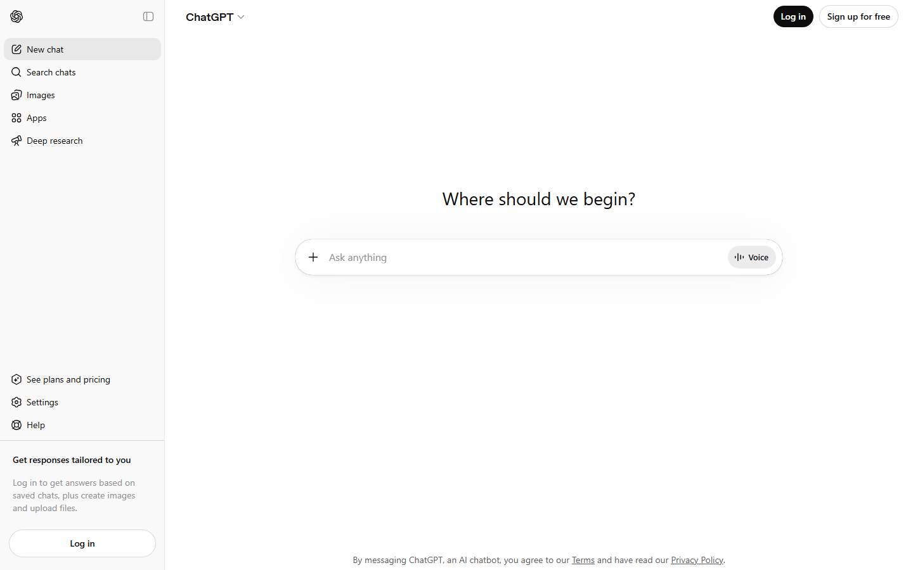

# Animation Reference

> Cinematic motion design extracted from live DOM. Follow these specs exactly to recreate the experience.

## Motion Technology Stack

| Library | Type | Notes |
|---------|------|-------|
| **Web Animations API (1 active)** | animation |  |

## Scroll Journey

The page is **900px** tall. Each frame below shows what the user sees at that scroll depth.

> **Use these screenshots to understand WHAT animates, WHEN it animates, and HOW it moves.**

### 0% — Top / Hero
Scroll position: 0px


### 17% — Opening Section
Scroll position: 0px


### 33% — First Feature Section
Scroll position: 0px


### 50% — Mid-Page
Scroll position: 0px



### 67% — Lower Content
Scroll position: 0px


### 83% — Near Footer
Scroll position: 0px


### 100% — Bottom / Footer
Scroll position: 0px


## Scroll Animation Patterns

| Pattern | Library | Element Count | Duration | Delay | Easing |
|---------|---------|---------------|----------|-------|--------|
| parallax / sticky scroll | CSS | 7 | — | — | — |

### CSS Implementation

## CSS Keyframes (110 extracted)

### `@keyframes pulseSize`

Duration: `1.25s` · Easing: `ease-in-out` · Delay: `0s` · Iteration: `infinite` · Fill: `none`

Used by: `.pulse > :not(ol, ul, pre, div):last-child::after, .pulse > pre:last-child code:`, `.result-thinking p:last-child::after`

```css
@keyframes pulseSize {
  0%, 100% {
    transform: scale(1);
  }
  50% {
    transform: scale(1.25);
  }
}
```

> Transform/motion animation

### `@keyframes pulseSize`

Duration: `1.25s` · Easing: `ease-in-out` · Delay: `0s` · Iteration: `infinite` · Fill: `none`

Used by: `.pulse > :not(ol, ul, pre, div):last-child::after, .pulse > pre:last-child code:`, `.result-thinking p:last-child::after`

```css
@keyframes pulseSize {
  0%, 100% {
    transform: scale(1);
  }
  50% {
    transform: scale(1.25);
  }
}
```

> Transform/motion animation

### `@keyframes toast-open`

Duration: `0.24s` · Easing: `cubic-bezier(0.175, 0.885, 0.32, 1)` · Delay: `0s` · Iteration: `1` · Fill: `both`

Used by: `.toast-root[data-state="entering"]`

```css
@keyframes toast-open {
  0% {
    opacity: 0;
    transform: translateY(-100%);
  }
  100% {
    opacity: 1;
    transform: translateY(0px);
  }
}
```

> Fade + motion enter animation

### `@keyframes toast-close`

Duration: `0.12s` · Easing: `cubic-bezier(0.4, 0, 1, 1)` · Delay: `0s` · Iteration: `1` · Fill: `both`

Used by: `.toast-root[data-state="exiting"]`

```css
@keyframes toast-close {
  0% {
    opacity: 1;
  }
  100% {
    opacity: 0;
  }
}
```

> Opacity fade

### `@keyframes icon-shimmer`

Duration: `5s` · Easing: `cubic-bezier(0.2, 0.44, 0.38, 1.02)` · Delay: `0s` · Iteration: `infinite` · Fill: `none`

Used by: `.icon-shimmer`

```css
@keyframes icon-shimmer {
  0% {
    -webkit-mask-position-x: 100%;
    -webkit-mask-position-y: center;
  }
  20% {
    -webkit-mask-position-x: 0px;
    -webkit-mask-position-y: center;
  }
  100% {
    -webkit-mask-position-x: 0px;
    -webkit-mask-position-y: center;
  }
}
```

### `@keyframes loading-results-shimmer`

Duration: `3s` · Easing: `linear` · Delay: `0s` · Iteration: `infinite` · Fill: `none`

Used by: `.loading-results-shimmer`

```css
@keyframes loading-results-shimmer {
  0% {
    background-position-x: -1000px;
    background-position-y: 0px;
  }
  100% {
    background-position-x: 1000px;
    background-position-y: 0px;
  }
}
```

> Background color/gradient shift · Background position (shimmer/scroll)

### `@keyframes scalePulse`

Duration: `3.5s` · Easing: `ease-in-out` · Delay: `0s` · Iteration: `infinite` · Fill: `none`

Used by: `.bg-scale-pulse`

```css
@keyframes scalePulse {
  0%, 100% {
    filter: blur();
    transform: scale(1);
  }
  50% {
    filter: blur(8px);
    transform: scale(1.1);
  }
}
```

> Transform/motion animation · Filter effect (blur/brightness)

### `@keyframes diagonalSweep`

Duration: `4s` · Easing: `ease-out` · Delay: `0s` · Iteration: `infinite` · Fill: `none`

Used by: `.diagonal-sweep-gradient`

```css
@keyframes diagonalSweep {
  0% {
    transform: translate(-100%, -100%);
  }
  100% {
    transform: translate(100%, 100%);
  }
}
```

> Transform/motion animation

### `@keyframes sR_mOW_places-sidebar-enter`

Used by: `.sR_mOW_places-overlay-transition::view-transition-new(sR_mOW_business-list-cont`

```css
@keyframes sR_mOW_places-sidebar-enter {
  0% {
    opacity: 0;
  }
  100% {
    opacity: 1;
  }
}
```

> Opacity fade

### `@keyframes sR_mOW_places-sidebar-exit`

Used by: `.sR_mOW_places-overlay-transition::view-transition-old(sR_mOW_business-list-cont`

```css
@keyframes sR_mOW_places-sidebar-exit {
  0% {
    opacity: 1;
  }
  100% {
    opacity: 0;
  }
}
```

> Opacity fade

### `@keyframes sR_mOW_pinnedOldFastFade`

Duration: `0.1s` · Easing: `var(--spring-fast)`

Used by: `.sR_mOW_pinned-widget::view-transition-old(sR_mOW_pinned-kanzi-widget)`

```css
@keyframes sR_mOW_pinnedOldFastFade {
  0% {
    opacity: 1;
  }
  20% {
    opacity: 0;
  }
  100% {
    opacity: 0;
  }
}
```

> Opacity fade

### `@keyframes mapboxgl-spin`

Duration: `2s` · Easing: `linear` · Delay: `0s` · Iteration: `infinite` · Fill: `none`

Used by: `.mapboxgl-ctrl button.mapboxgl-ctrl-geolocate.mapboxgl-ctrl-geolocate-waiting .m`

```css
@keyframes mapboxgl-spin {
  0% {
    transform: rotate(0deg);
  }
  100% {
    transform: rotate(1turn);
  }
}
```

> Transform/motion animation

### `@keyframes mapboxgl-user-location-dot-pulse`

Duration: `2s` · Easing: `ease` · Delay: `0s` · Iteration: `infinite` · Fill: `none`

Used by: `.mapboxgl-user-location-dot::before`

```css
@keyframes mapboxgl-user-location-dot-pulse {
  0% {
    opacity: 1;
    transform: scale(1);
  }
  70% {
    opacity: 0;
    transform: scale(3);
  }
  100% {
    opacity: 0;
    transform: scale(1);
  }
}
```

> Fade + motion enter animation

### `@keyframes swiper-preloader-spin`

Duration: `1s` · Easing: `linear` · Delay: `0s` · Iteration: `infinite` · Fill: `none`

Used by: `:is(.swiper:not(.swiper-watch-progress), .swiper-watch-progress .swiper-slide-vi`

```css
@keyframes swiper-preloader-spin {
  0% {
    transform: rotate(0deg);
  }
  100% {
    transform: rotate(360deg);
  }
}
```

> Transform/motion animation

### `@keyframes bgaZlG_businessTooltipIn`

Duration: `0.18s` · Easing: `ease-out` · Delay: `0s` · Iteration: `1` · Fill: `both`

Used by: `.bgaZlG_tooltipOpen`

```css
@keyframes bgaZlG_businessTooltipIn {
  0% {
    opacity: 0;
    transform: scale(0.9);
  }
  100% {
    opacity: 1;
    transform: scale(1);
  }
}
```

> Fade + motion enter animation

### `@keyframes bgaZlG_businessTooltipOut`

Duration: `0.14s` · Easing: `ease-in` · Delay: `0s` · Iteration: `1` · Fill: `both`

Used by: `.bgaZlG_tooltipClosing`

```css
@keyframes bgaZlG_businessTooltipOut {
  0% {
    opacity: 1;
    transform: scale(1);
  }
  100% {
    opacity: 0;
    transform: scale(0.9);
  }
}
```

> Fade + motion enter animation

### `@keyframes BqefNq_userMarkerPulse`

Duration: `1.8s` · Easing: `cubic-bezier(0.4, 0, 0.6, 1)` · Delay: `0s` · Iteration: `infinite` · Fill: `none`

Used by: `.BqefNq_userMarkerPulse`

```css
@keyframes BqefNq_userMarkerPulse {
  0%, 100% {
    transform: scale(1);
  }
  50% {
    transform: scale(1.1);
  }
}
```

> Transform/motion animation

### `@keyframes _ephxG_Shimmer`

Duration: `2s` · Easing: `ease` · Delay: `0s` · Iteration: `infinite` · Fill: `none`

Used by: `._ephxG_ShimmerText[data-active]`

```css
@keyframes _ephxG_Shimmer {
  0% {
  }
  100% {
  }
}
```

> Background color/gradient shift · Background position (shimmer/scroll)

### `@keyframes QKycbG_fade`

Duration: `0.4s` · Easing: `ease` · Delay: `50ms` · Iteration: `1` · Fill: `forwards`

Used by: `.QKycbG_markdown.markdown .katex-display`

```css
@keyframes QKycbG_fade {
  0% {
    opacity: 0;
  }
  100% {
    opacity: 1;
  }
}
```

> Opacity fade

### `@keyframes sPZ93q_add-top-shadow`

Duration: `auto` · Easing: `linear` · Delay: `0s` · Iteration: `1` · Fill: `both`

Used by: `.sPZ93q_leadingBar`

```css
@keyframes sPZ93q_add-top-shadow {
  0% {
    box-shadow: rgba(0, 0, 0, 0) 0px 1px;
  }
  0.1%, 100% {
    box-shadow: 0 1px 0 var(--border-sharp);
  }
}
```

> Shadow pulse/glow effect

### `@keyframes sPZ93q_add-bottom-shadow`

Duration: `auto` · Easing: `linear` · Delay: `0s` · Iteration: `1` · Fill: `both`

Used by: `.sPZ93q_trailingBar`

```css
@keyframes sPZ93q_add-bottom-shadow {
  0%, 99.9% {
    box-shadow: 0 -1px 0 var(--border-sharp);
  }
  100% {
    box-shadow: rgba(0, 0, 0, 0) 0px -1px;
  }
}
```

> Shadow pulse/glow effect

### `@keyframes toast-open`

Duration: `0.24s` · Easing: `cubic-bezier(0.175, 0.885, 0.32, 1)` · Delay: `0s` · Iteration: `1` · Fill: `both`

Used by: `.toast-root[data-state="entering"]`

```css
@keyframes toast-open {
  0% {
    opacity: 0;
    transform: translateY(-100%);
  }
  100% {
    opacity: 1;
    transform: translateY(0px);
  }
}
```

> Fade + motion enter animation

### `@keyframes toast-close`

Duration: `0.12s` · Easing: `cubic-bezier(0.4, 0, 1, 1)` · Delay: `0s` · Iteration: `1` · Fill: `both`

Used by: `.toast-root[data-state="exiting"]`

```css
@keyframes toast-close {
  0% {
    opacity: 1;
  }
  100% {
    opacity: 0;
  }
}
```

> Opacity fade

### `@keyframes icon-shimmer`

Duration: `5s` · Easing: `cubic-bezier(0.2, 0.44, 0.38, 1.02)` · Delay: `0s` · Iteration: `infinite` · Fill: `none`

Used by: `.icon-shimmer`

```css
@keyframes icon-shimmer {
  0% {
    -webkit-mask-position-x: 100%;
    -webkit-mask-position-y: center;
  }
  20% {
    -webkit-mask-position-x: 0px;
    -webkit-mask-position-y: center;
  }
  100% {
    -webkit-mask-position-x: 0px;
    -webkit-mask-position-y: center;
  }
}
```

### `@keyframes loading-results-shimmer`

Duration: `3s` · Easing: `linear` · Delay: `0s` · Iteration: `infinite` · Fill: `none`

Used by: `.loading-results-shimmer`

```css
@keyframes loading-results-shimmer {
  0% {
    background-position-x: -1000px;
    background-position-y: 0px;
  }
  100% {
    background-position-x: 1000px;
    background-position-y: 0px;
  }
}
```

> Background color/gradient shift · Background position (shimmer/scroll)

### `@keyframes scalePulse`

Duration: `3.5s` · Easing: `ease-in-out` · Delay: `0s` · Iteration: `infinite` · Fill: `none`

Used by: `.bg-scale-pulse`

```css
@keyframes scalePulse {
  0%, 100% {
    filter: blur();
    transform: scale(1);
  }
  50% {
    filter: blur(8px);
    transform: scale(1.1);
  }
}
```

> Transform/motion animation · Filter effect (blur/brightness)

### `@keyframes diagonalSweep`

Duration: `4s` · Easing: `ease-out` · Delay: `0s` · Iteration: `infinite` · Fill: `none`

Used by: `.diagonal-sweep-gradient`

```css
@keyframes diagonalSweep {
  0% {
    transform: translate(-100%, -100%);
  }
  100% {
    transform: translate(100%, 100%);
  }
}
```

> Transform/motion animation

### `@keyframes sR_mOW_places-sidebar-enter`

Used by: `.sR_mOW_places-overlay-transition::view-transition-new(sR_mOW_business-list-cont`

```css
@keyframes sR_mOW_places-sidebar-enter {
  0% {
    opacity: 0;
  }
  100% {
    opacity: 1;
  }
}
```

> Opacity fade

### `@keyframes sR_mOW_places-sidebar-exit`

Used by: `.sR_mOW_places-overlay-transition::view-transition-old(sR_mOW_business-list-cont`

```css
@keyframes sR_mOW_places-sidebar-exit {
  0% {
    opacity: 1;
  }
  100% {
    opacity: 0;
  }
}
```

> Opacity fade

### `@keyframes sR_mOW_pinnedOldFastFade`

Duration: `0.1s` · Easing: `var(--spring-fast)`

Used by: `.sR_mOW_pinned-widget::view-transition-old(sR_mOW_pinned-kanzi-widget)`

```css
@keyframes sR_mOW_pinnedOldFastFade {
  0% {
    opacity: 1;
  }
  20% {
    opacity: 0;
  }
  100% {
    opacity: 0;
  }
}
```

> Opacity fade

### `@keyframes mapboxgl-spin`

Duration: `2s` · Easing: `linear` · Delay: `0s` · Iteration: `infinite` · Fill: `none`

Used by: `.mapboxgl-ctrl button.mapboxgl-ctrl-geolocate.mapboxgl-ctrl-geolocate-waiting .m`

```css
@keyframes mapboxgl-spin {
  0% {
    transform: rotate(0deg);
  }
  100% {
    transform: rotate(1turn);
  }
}
```

> Transform/motion animation

### `@keyframes mapboxgl-user-location-dot-pulse`

Duration: `2s` · Easing: `ease` · Delay: `0s` · Iteration: `infinite` · Fill: `none`

Used by: `.mapboxgl-user-location-dot::before`

```css
@keyframes mapboxgl-user-location-dot-pulse {
  0% {
    opacity: 1;
    transform: scale(1);
  }
  70% {
    opacity: 0;
    transform: scale(3);
  }
  100% {
    opacity: 0;
    transform: scale(1);
  }
}
```

> Fade + motion enter animation

### `@keyframes swiper-preloader-spin`

Duration: `1s` · Easing: `linear` · Delay: `0s` · Iteration: `infinite` · Fill: `none`

Used by: `:is(.swiper:not(.swiper-watch-progress), .swiper-watch-progress .swiper-slide-vi`

```css
@keyframes swiper-preloader-spin {
  0% {
    transform: rotate(0deg);
  }
  100% {
    transform: rotate(360deg);
  }
}
```

> Transform/motion animation

### `@keyframes bgaZlG_businessTooltipIn`

Duration: `0.18s` · Easing: `ease-out` · Delay: `0s` · Iteration: `1` · Fill: `both`

Used by: `.bgaZlG_tooltipOpen`

```css
@keyframes bgaZlG_businessTooltipIn {
  0% {
    opacity: 0;
    transform: scale(0.9);
  }
  100% {
    opacity: 1;
    transform: scale(1);
  }
}
```

> Fade + motion enter animation

### `@keyframes bgaZlG_businessTooltipOut`

Duration: `0.14s` · Easing: `ease-in` · Delay: `0s` · Iteration: `1` · Fill: `both`

Used by: `.bgaZlG_tooltipClosing`

```css
@keyframes bgaZlG_businessTooltipOut {
  0% {
    opacity: 1;
    transform: scale(1);
  }
  100% {
    opacity: 0;
    transform: scale(0.9);
  }
}
```

> Fade + motion enter animation

### `@keyframes BqefNq_userMarkerPulse`

Duration: `1.8s` · Easing: `cubic-bezier(0.4, 0, 0.6, 1)` · Delay: `0s` · Iteration: `infinite` · Fill: `none`

Used by: `.BqefNq_userMarkerPulse`

```css
@keyframes BqefNq_userMarkerPulse {
  0%, 100% {
    transform: scale(1);
  }
  50% {
    transform: scale(1.1);
  }
}
```

> Transform/motion animation

### `@keyframes _ephxG_Shimmer`

Duration: `2s` · Easing: `ease` · Delay: `0s` · Iteration: `infinite` · Fill: `none`

Used by: `._ephxG_ShimmerText[data-active]`

```css
@keyframes _ephxG_Shimmer {
  0% {
  }
  100% {
  }
}
```

> Background color/gradient shift · Background position (shimmer/scroll)

### `@keyframes QKycbG_fade`

Duration: `0.4s` · Easing: `ease` · Delay: `50ms` · Iteration: `1` · Fill: `forwards`

Used by: `.QKycbG_markdown.markdown .katex-display`

```css
@keyframes QKycbG_fade {
  0% {
    opacity: 0;
  }
  100% {
    opacity: 1;
  }
}
```

> Opacity fade

### `@keyframes sPZ93q_add-top-shadow`

Duration: `auto` · Easing: `linear` · Delay: `0s` · Iteration: `1` · Fill: `both`

Used by: `.sPZ93q_leadingBar`

```css
@keyframes sPZ93q_add-top-shadow {
  0% {
    box-shadow: rgba(0, 0, 0, 0) 0px 1px;
  }
  0.1%, 100% {
    box-shadow: 0 1px 0 var(--border-sharp);
  }
}
```

> Shadow pulse/glow effect

### `@keyframes sPZ93q_add-bottom-shadow`

Duration: `auto` · Easing: `linear` · Delay: `0s` · Iteration: `1` · Fill: `both`

Used by: `.sPZ93q_trailingBar`

```css
@keyframes sPZ93q_add-bottom-shadow {
  0%, 99.9% {
    box-shadow: 0 -1px 0 var(--border-sharp);
  }
  100% {
    box-shadow: rgba(0, 0, 0, 0) 0px -1px;
  }
}
```

> Shadow pulse/glow effect

### `@keyframes peek-top-animation`

```css
@keyframes peek-top-animation {
  50% {
    translate: 0px -85px;
  }
  75% {
    translate: 0px -85px;
  }
  100% {
    translate: 0px;
  }
}
```

### `@keyframes peek-top-end-animation`

```css
@keyframes peek-top-end-animation {
  100% {
    translate: 0px;
  }
}
```

### `@keyframes mask-shimmer-offset-move`

```css
@keyframes mask-shimmer-offset-move {
  0% {
    --mask-shimmer-offset: 0%;
  }
  100% {
    --mask-shimmer-offset: 100%;
  }
}
```

### `@keyframes blink`

```css
@keyframes blink {
  100% {
    visibility: hidden;
  }
}
```

### `@keyframes show`

```css
@keyframes show {
  0% {
    opacity: 0;
  }
  100% {
    opacity: 1;
  }
}
```

> Opacity fade

### `@keyframes add-top-shadow`

```css
@keyframes add-top-shadow {
  0% {
    box-shadow: var(--sharp-edge-top-shadow-placeholder);
  }
  0.1%, 100% {
    box-shadow: var(--sharp-edge-top-shadow);
  }
}
```

> Shadow pulse/glow effect

### `@keyframes add-bottom-shadow`

```css
@keyframes add-bottom-shadow {
  0%, 99.9% {
    box-shadow: var(--sharp-edge-bottom-shadow);
  }
  100% {
    box-shadow: var(--sharp-edge-bottom-shadow-placeholder);
  }
}
```

> Shadow pulse/glow effect

### `@keyframes shimmer-skeleton`

```css
@keyframes shimmer-skeleton {
  0% {
    background-position-x: 100%;
    background-position-y: center;
  }
  100% {
    background-position-x: 0%;
    background-position-y: center;
  }
}
```

> Background color/gradient shift · Background position (shimmer/scroll)

### `@keyframes pulse-dot`

```css
@keyframes pulse-dot {
  0% {
    opacity: 0.1;
    scale: 0.7;
  }
  50% {
    transform: scale(var(--pulse-scale,1.3));
    opacity: 1;
  }
  100% {
    opacity: 0;
    transform: scale(0.7);
  }
}
```

> Fade + motion enter animation

### `@keyframes float-sidebar-in`

```css
@keyframes float-sidebar-in {
  0% {
    opacity: 0;
    translate: -60%;
  }
  70% {
    opacity: 1;
  }
  100% {
    translate: 0px;
  }
}
```

> Opacity fade

### `@keyframes float-sidebar-out`

```css
@keyframes float-sidebar-out {
  0% {
    translate: 0px;
  }
  30% {
    opacity: 1;
  }
  100% {
    opacity: 0;
    translate: -60%;
  }
}
```

> Opacity fade

### `@keyframes loading-shimmer`

```css
@keyframes loading-shimmer {
  0% {
  }
  100% {
  }
}
```

> Background color/gradient shift · Background position (shimmer/scroll)

### `@keyframes rotateShine`

```css
@keyframes rotateShine {
  0% {
    opacity: 0;
    transform: rotate(var(--feh-border-glow-start-rotation,0deg)) translate(-50%, -50%);
  }
  68% {
    opacity: 0;
    transform: rotate(var(--feh-border-glow-start-rotation,0deg)) translate(-50%, -50%);
  }
  72% {
    opacity: 1;
  }
  100% {
    opacity: 0;
    transform: rotate(calc(var(--feh-border-glow-start-rotation,0deg) + 360deg)) translate(-50%, -50%);
  }
}
```

> Fade + motion enter animation

### `@keyframes rotateShineContinuous`

```css
@keyframes rotateShineContinuous {
  0% {
    opacity: 1;
    transform: rotate(var(--feh-border-glow-start-rotation,0deg)) translate(-50%, -50%);
  }
  100% {
    opacity: 1;
    transform: rotate(calc(var(--feh-border-glow-start-rotation,0deg) + 360deg)) translate(-50%, -50%);
  }
}
```

> Fade + motion enter animation

### `@keyframes upgrade-button-gleam`

```css
@keyframes upgrade-button-gleam {
  0% {
    opacity: 0;
    transform: translate(-150%) skew(-18deg);
  }
  68% {
    opacity: 0;
    transform: translate(-150%) skew(-18deg);
  }
  72% {
    opacity: 0.6;
  }
  100% {
    opacity: 0;
    transform: translate(150%) skew(-18deg);
  }
}
```

> Fade + motion enter animation

### `@keyframes spin`

```css
@keyframes spin {
  0% {
    transform: rotate(0deg);
  }
  100% {
    transform: rotate(360deg);
  }
}
```

> Transform/motion animation

### `@keyframes pulse`

```css
@keyframes pulse {
  50% {
    opacity: 0.5;
  }
}
```

> Opacity fade

### `@keyframes bounce`

```css
@keyframes bounce {
  0%, 100% {
    animation-timing-function: cubic-bezier(0.8, 0, 1, 1);
    transform: translateY(-25%);
  }
  50% {
    animation-timing-function: cubic-bezier(0, 0, 0.2, 1);
    transform: none;
  }
}
```

> Transform/motion animation

### `@keyframes pulsing`

```css
@keyframes pulsing {
  0% {
    opacity: 1;
    scale: 1;
  }
  50% {
    opacity: 0.9;
    scale: 0.875;
  }
  100% {
    opacity: 1;
    scale: 1;
  }
}
```

> Opacity fade

### `@keyframes slideDownAndFade`

```css
@keyframes slideDownAndFade {
  0% {
    opacity: 0;
    transform: translateY(-1px);
  }
  100% {
    opacity: 1;
    transform: translateY(0px);
  }
}
```

> Fade + motion enter animation

### `@keyframes slideLeftAndFade`

```css
@keyframes slideLeftAndFade {
  0% {
    opacity: 0;
    transform: translate(1px);
  }
  100% {
    opacity: 1;
    transform: translate(0px);
  }
}
```

> Fade + motion enter animation

### `@keyframes contentShow`

```css
@keyframes contentShow {
  0% {
    opacity: 0;
    transform: scale(0.96);
  }
  100% {
    opacity: 1;
    transform: scale(1);
  }
}
```

> Fade + motion enter animation

### `@keyframes alertShow`

```css
@keyframes alertShow {
  0% {
    opacity: 0;
    transform: translate(-50%, -48%) scale(0.96);
  }
  100% {
    opacity: 1;
    transform: translate(-50%, -50%) scale(1);
  }
}
```

> Fade + motion enter animation

### `@keyframes slide-in-right`

```css
@keyframes slide-in-right {
  0% {
    transform: translate(100%);
  }
  100% {
    transform: translate(0px);
  }
}
```

> Transform/motion animation

### `@keyframes slide-out-left`

```css
@keyframes slide-out-left {
  0% {
    transform: translate(0px);
  }
  100% {
    transform: translate(-100%);
  }
}
```

> Transform/motion animation

### `@keyframes slide-in-left`

```css
@keyframes slide-in-left {
  0% {
    transform: translate(-100%);
  }
  100% {
    transform: translate(0px);
  }
}
```

> Transform/motion animation

### `@keyframes slide-out-right`

```css
@keyframes slide-out-right {
  0% {
    transform: translate(0px);
  }
  100% {
    transform: translate(100%);
  }
}
```

> Transform/motion animation

### `@keyframes mkt-slide-anim`

```css
@keyframes mkt-slide-anim {
  0% {
    transform: translate(0px);
  }
  50% {
    left: 0px;
  }
  100% {
    transform: translateX(calc(-100% * var(--to-end-unit,1)));
  }
}
```

> Transform/motion animation

### `@keyframes sR_mOW_slide-up`

```css
@keyframes sR_mOW_slide-up {
  0% {
    opacity: 0;
    translate: 0px 20vw;
  }
}
```

> Opacity fade

### `@keyframes sR_mOW_slide-down`

```css
@keyframes sR_mOW_slide-down {
  100% {
    opacity: 0;
    translate: 0px 20vw;
  }
}
```

> Opacity fade

### `@keyframes sR_mOW_popover-thread-enter`

```css
@keyframes sR_mOW_popover-thread-enter {
  0% {
    opacity: 0;
    transform: scale(0.98);
  }
  100% {
    opacity: 1;
    transform: scale(1);
  }
}
```

> Fade + motion enter animation

### `@keyframes sR_mOW_popover-thread-exit`

```css
@keyframes sR_mOW_popover-thread-exit {
  0% {
    opacity: 1;
    transform: scale(1);
  }
  100% {
    opacity: 0;
    transform: scale(0.98);
  }
}
```

> Fade + motion enter animation

### `@keyframes -fBEMq_user-message-truncation-detect-scroll`

```css
@keyframes -fBEMq_user-message-truncation-detect-scroll {
  0%, 100% {
    --user-message-can-scroll: 1;
  }
}
```

### `@keyframes BZ_Pyq_fade-in`

```css
@keyframes BZ_Pyq_fade-in {
  100% {
    opacity: 1;
  }
}
```

> Opacity fade

### `@keyframes e33vkq_working-dot-wave`

```css
@keyframes e33vkq_working-dot-wave {
  0%, 10%, 100% {
    transform: translateY(0px);
  }
  25% {
    transform: translateY(1.2px);
  }
  55% {
    transform: translateY(-2px);
  }
  70% {
    transform: translateY(0px);
  }
}
```

> Transform/motion animation

### `@keyframes peek-top-animation`

```css
@keyframes peek-top-animation {
  50% {
    translate: 0px -85px;
  }
  75% {
    translate: 0px -85px;
  }
  100% {
    translate: 0px;
  }
}
```

### `@keyframes peek-top-end-animation`

```css
@keyframes peek-top-end-animation {
  100% {
    translate: 0px;
  }
}
```

### `@keyframes mask-shimmer-offset-move`

```css
@keyframes mask-shimmer-offset-move {
  0% {
    --mask-shimmer-offset: 0%;
  }
  100% {
    --mask-shimmer-offset: 100%;
  }
}
```

### `@keyframes blink`

```css
@keyframes blink {
  100% {
    visibility: hidden;
  }
}
```

### `@keyframes show`

```css
@keyframes show {
  0% {
    opacity: 0;
  }
  100% {
    opacity: 1;
  }
}
```

> Opacity fade

### `@keyframes add-top-shadow`

```css
@keyframes add-top-shadow {
  0% {
    box-shadow: var(--sharp-edge-top-shadow-placeholder);
  }
  0.1%, 100% {
    box-shadow: var(--sharp-edge-top-shadow);
  }
}
```

> Shadow pulse/glow effect

### `@keyframes add-bottom-shadow`

```css
@keyframes add-bottom-shadow {
  0%, 99.9% {
    box-shadow: var(--sharp-edge-bottom-shadow);
  }
  100% {
    box-shadow: var(--sharp-edge-bottom-shadow-placeholder);
  }
}
```

> Shadow pulse/glow effect

### `@keyframes shimmer-skeleton`

```css
@keyframes shimmer-skeleton {
  0% {
    background-position-x: 100%;
    background-position-y: center;
  }
  100% {
    background-position-x: 0%;
    background-position-y: center;
  }
}
```

> Background color/gradient shift · Background position (shimmer/scroll)

### `@keyframes pulse-dot`

```css
@keyframes pulse-dot {
  0% {
    opacity: 0.1;
    scale: 0.7;
  }
  50% {
    transform: scale(var(--pulse-scale,1.3));
    opacity: 1;
  }
  100% {
    opacity: 0;
    transform: scale(0.7);
  }
}
```

> Fade + motion enter animation

### `@keyframes float-sidebar-in`

```css
@keyframes float-sidebar-in {
  0% {
    opacity: 0;
    translate: -60%;
  }
  70% {
    opacity: 1;
  }
  100% {
    translate: 0px;
  }
}
```

> Opacity fade

### `@keyframes float-sidebar-out`

```css
@keyframes float-sidebar-out {
  0% {
    translate: 0px;
  }
  30% {
    opacity: 1;
  }
  100% {
    opacity: 0;
    translate: -60%;
  }
}
```

> Opacity fade

### `@keyframes loading-shimmer`

```css
@keyframes loading-shimmer {
  0% {
  }
  100% {
  }
}
```

> Background color/gradient shift · Background position (shimmer/scroll)

### `@keyframes rotateShine`

```css
@keyframes rotateShine {
  0% {
    opacity: 0;
    transform: rotate(var(--feh-border-glow-start-rotation,0deg)) translate(-50%, -50%);
  }
  68% {
    opacity: 0;
    transform: rotate(var(--feh-border-glow-start-rotation,0deg)) translate(-50%, -50%);
  }
  72% {
    opacity: 1;
  }
  100% {
    opacity: 0;
    transform: rotate(calc(var(--feh-border-glow-start-rotation,0deg) + 360deg)) translate(-50%, -50%);
  }
}
```

> Fade + motion enter animation

### `@keyframes rotateShineContinuous`

```css
@keyframes rotateShineContinuous {
  0% {
    opacity: 1;
    transform: rotate(var(--feh-border-glow-start-rotation,0deg)) translate(-50%, -50%);
  }
  100% {
    opacity: 1;
    transform: rotate(calc(var(--feh-border-glow-start-rotation,0deg) + 360deg)) translate(-50%, -50%);
  }
}
```

> Fade + motion enter animation

### `@keyframes upgrade-button-gleam`

```css
@keyframes upgrade-button-gleam {
  0% {
    opacity: 0;
    transform: translate(-150%) skew(-18deg);
  }
  68% {
    opacity: 0;
    transform: translate(-150%) skew(-18deg);
  }
  72% {
    opacity: 0.6;
  }
  100% {
    opacity: 0;
    transform: translate(150%) skew(-18deg);
  }
}
```

> Fade + motion enter animation

### `@keyframes spin`

```css
@keyframes spin {
  0% {
    transform: rotate(0deg);
  }
  100% {
    transform: rotate(360deg);
  }
}
```

> Transform/motion animation

### `@keyframes pulse`

```css
@keyframes pulse {
  50% {
    opacity: 0.5;
  }
}
```

> Opacity fade

### `@keyframes bounce`

```css
@keyframes bounce {
  0%, 100% {
    animation-timing-function: cubic-bezier(0.8, 0, 1, 1);
    transform: translateY(-25%);
  }
  50% {
    animation-timing-function: cubic-bezier(0, 0, 0.2, 1);
    transform: none;
  }
}
```

> Transform/motion animation

### `@keyframes pulsing`

```css
@keyframes pulsing {
  0% {
    opacity: 1;
    scale: 1;
  }
  50% {
    opacity: 0.9;
    scale: 0.875;
  }
  100% {
    opacity: 1;
    scale: 1;
  }
}
```

> Opacity fade

### `@keyframes slideDownAndFade`

```css
@keyframes slideDownAndFade {
  0% {
    opacity: 0;
    transform: translateY(-1px);
  }
  100% {
    opacity: 1;
    transform: translateY(0px);
  }
}
```

> Fade + motion enter animation

### `@keyframes slideLeftAndFade`

```css
@keyframes slideLeftAndFade {
  0% {
    opacity: 0;
    transform: translate(1px);
  }
  100% {
    opacity: 1;
    transform: translate(0px);
  }
}
```

> Fade + motion enter animation

### `@keyframes contentShow`

```css
@keyframes contentShow {
  0% {
    opacity: 0;
    transform: scale(0.96);
  }
  100% {
    opacity: 1;
    transform: scale(1);
  }
}
```

> Fade + motion enter animation

### `@keyframes alertShow`

```css
@keyframes alertShow {
  0% {
    opacity: 0;
    transform: translate(-50%, -48%) scale(0.96);
  }
  100% {
    opacity: 1;
    transform: translate(-50%, -50%) scale(1);
  }
}
```

> Fade + motion enter animation

### `@keyframes slide-in-right`

```css
@keyframes slide-in-right {
  0% {
    transform: translate(100%);
  }
  100% {
    transform: translate(0px);
  }
}
```

> Transform/motion animation

### `@keyframes slide-out-left`

```css
@keyframes slide-out-left {
  0% {
    transform: translate(0px);
  }
  100% {
    transform: translate(-100%);
  }
}
```

> Transform/motion animation

### `@keyframes slide-in-left`

```css
@keyframes slide-in-left {
  0% {
    transform: translate(-100%);
  }
  100% {
    transform: translate(0px);
  }
}
```

> Transform/motion animation

### `@keyframes slide-out-right`

```css
@keyframes slide-out-right {
  0% {
    transform: translate(0px);
  }
  100% {
    transform: translate(100%);
  }
}
```

> Transform/motion animation

### `@keyframes mkt-slide-anim`

```css
@keyframes mkt-slide-anim {
  0% {
    transform: translate(0px);
  }
  50% {
    left: 0px;
  }
  100% {
    transform: translateX(calc(-100% * var(--to-end-unit,1)));
  }
}
```

> Transform/motion animation

### `@keyframes sR_mOW_slide-up`

```css
@keyframes sR_mOW_slide-up {
  0% {
    opacity: 0;
    translate: 0px 20vw;
  }
}
```

> Opacity fade

### `@keyframes sR_mOW_slide-down`

```css
@keyframes sR_mOW_slide-down {
  100% {
    opacity: 0;
    translate: 0px 20vw;
  }
}
```

> Opacity fade

### `@keyframes sR_mOW_popover-thread-enter`

```css
@keyframes sR_mOW_popover-thread-enter {
  0% {
    opacity: 0;
    transform: scale(0.98);
  }
  100% {
    opacity: 1;
    transform: scale(1);
  }
}
```

> Fade + motion enter animation

### `@keyframes sR_mOW_popover-thread-exit`

```css
@keyframes sR_mOW_popover-thread-exit {
  0% {
    opacity: 1;
    transform: scale(1);
  }
  100% {
    opacity: 0;
    transform: scale(0.98);
  }
}
```

> Fade + motion enter animation

### `@keyframes -fBEMq_user-message-truncation-detect-scroll`

```css
@keyframes -fBEMq_user-message-truncation-detect-scroll {
  0%, 100% {
    --user-message-can-scroll: 1;
  }
}
```

### `@keyframes BZ_Pyq_fade-in`

```css
@keyframes BZ_Pyq_fade-in {
  100% {
    opacity: 1;
  }
}
```

> Opacity fade

### `@keyframes e33vkq_working-dot-wave`

```css
@keyframes e33vkq_working-dot-wave {
  0%, 10%, 100% {
    transform: translateY(0px);
  }
  25% {
    transform: translateY(1.2px);
  }
  55% {
    transform: translateY(-2px);
  }
  70% {
    transform: translateY(0px);
  }
}
```

> Transform/motion animation

## Motion Tokens (CSS Variables)

### Duration Tokens

```css
--spring-fast-duration: .667s;
--spring-common-duration: .667s;
--spring-slow-bounce-duration: 1.167s;
--spring-bounce-duration: .833s;
--spring-fast-bounce-duration: 1s;
--easing-spring-elegant-duration: .58171s;
--cot-shimmer-duration: 2s;
--spring-fast-duration: .667s;
--spring-common-duration: .667s;
--spring-slow-bounce-duration: 1.167s;
--spring-bounce-duration: .833s;
--spring-fast-bounce-duration: 1s;
--easing-spring-elegant-duration: .58171s;
--cot-shimmer-duration: 2s;
--default-transition-duration: .15s;
--tw-mask-shimmer-duration: 4s;
```

### Easing Tokens

```css
--ease-in: cubic-bezier(.4, 0, 1, 1);
--default-transition-timing-function: cubic-bezier(.4, 0, .2, 1);
--ease-out: cubic-bezier(0, 0, .2, 1);
--ease-in-out: cubic-bezier(.4, 0, .2, 1);
```

### Delay Tokens

```css
--tw-mask-shimmer-delay: 0s;
```

### Other Tokens

```css
--spring-fast: linear(0, .01942 1.83%, .07956 4.02%, .47488 13.851%, .65981 19.572%, .79653 25.733%, .84834 29.083%, .89048 32.693%, .9246 36.734%, .95081 41.254%, .97012 46.425%, .98361 52.535%, .99665 68.277%, .99988);
--spring-common: linear(0, .00506 1.18%, .02044 2.46%, .08322 5.391%, .46561 17.652%, .63901 24.342%, .76663 31.093%, .85981 38.454%, .89862 42.934%, .92965 47.845%, .95366 53.305%, .97154 59.516%, .99189 74.867%, .9991);
--spring-standard: var(--spring-common);
--spring-slow-bounce: linear(0, .00172 0.51%, .00682 1.03%, .02721 2.12%, .06135 3.29%, .11043 4.58%, .21945 6.911%, .59552 14.171%, .70414 16.612%, .79359 18.962%, .86872 21.362%, .92924 23.822%, .97589 26.373%, 1.01 29.083%, 1.0264 31.043%, 1.03767 33.133%, 1.04411 35.404%, 1.04597 37.944%, 1.04058 42.454%, 1.01119 55.646%, 1.00137 63.716%, .99791 74.127%, .99988);
--spring-bounce: linear(0, .00541 1.29%, .02175 2.68%, .04923 4.19%, .08852 5.861%, .17388 8.851%, .48317 18.732%, .57693 22.162%, .65685 25.503%, .72432 28.793%, .78235 32.163%, .83182 35.664%, .87356 39.354%, .91132 43.714%, .94105 48.455%, .96361 53.705%, .97991 59.676%, .9903 66.247%, .99664 74.237%, .99968 84.358%, 1.00048);
--spring-fast-bounce: linear(0, .00683 1.14%, .02731 2.35%, .11137 5.091%, .59413 15.612%, .78996 20.792%, .92396 25.953%, .97109 28.653%, 1.00624 31.503%, 1.03801 36.154%, 1.0477 41.684%, 1.00242 68.787%, .99921);
--easing-spring-elegant: linear(0 0%, .005927 1%, .022466 2%, .047872 3%, .080554 4%, .119068 5%, .162116 6%, .208536 7.0%, .2573 8%, .3075 9%, .358346 10%, .409157 11%, .45935 12%, .508438 13%, .556014 14.0%, .601751 15%, .645389 16%, .686733 17%, .72564 18%, .762019 19%, .795818 20%, .827026 21%, .855662 22%, .881772 23%, .905423 24%, .926704 25%, .945714 26%, .962568 27%, .977386 28.0%, .990295 29.0%, 1.00143 30%, 1.01091 31%, 1.01888 32%, 1.02547 33%, 1.03079 34%, 1.03498 35%, 1.03816 36%, 1.04042 37%, 1.04189 38%, 1.04266 39%, 1.04283 40%, 1.04247 41%, 1.04168 42%, 1.04052 43%, 1.03907 44%, 1.03737 45%, 1.03549 46%, 1.03348 47%, 1.03138 48%, 1.02922 49%, 1.02704 50%, 1.02486 51%, 1.02272 52%, 1.02063 53%, 1.01861 54%, 1.01667 55.0%, 1.01482 56.0%, 1.01307 57.0%, 1.01142 58.0%, 1.00989 59%, 1.00846 60%, 1.00715 61%, 1.00594 62%, 1.00485 63%, 1.00386 64%, 1.00296 65%, 1.00217 66%, 1.00147 67%, 1.00085 68%, 1.00031 69%, .999849 70%, .999457 71%, .999128 72%, .998858 73%, .99864 74%, .99847 75%, .998342 76%, .998253 77%, .998196 78%, .998169 79%, .998167 80%, .998186 81%, .998224 82%, .998276 83%, .998341 84%, .998415 85%, .998497 86%, .998584 87%, .998675 88%, .998768 89%, .998861 90%, .998954 91%, .999045 92%, .999134 93%, .99922 94%, .999303 95%, .999381 96%, .999455 97%, .999525 98%, .999589 99%, .99965 100%);
--spring-fast: linear(0, .01942 1.83%, .07956 4.02%, .47488 13.851%, .65981 19.572%, .79653 25.733%, .84834 29.083%, .89048 32.693%, .9246 36.734%, .95081 41.254%, .97012 46.425%, .98361 52.535%, .99665 68.277%, .99988);
--spring-common: linear(0, .00506 1.18%, .02044 2.46%, .08322 5.391%, .46561 17.652%, .63901 24.342%, .76663 31.093%, .85981 38.454%, .89862 42.934%, .92965 47.845%, .95366 53.305%, .97154 59.516%, .99189 74.867%, .9991);
--spring-standard: var(--spring-common);
--spring-slow-bounce: linear(0, .00172 0.51%, .00682 1.03%, .02721 2.12%, .06135 3.29%, .11043 4.58%, .21945 6.911%, .59552 14.171%, .70414 16.612%, .79359 18.962%, .86872 21.362%, .92924 23.822%, .97589 26.373%, 1.01 29.083%, 1.0264 31.043%, 1.03767 33.133%, 1.04411 35.404%, 1.04597 37.944%, 1.04058 42.454%, 1.01119 55.646%, 1.00137 63.716%, .99791 74.127%, .99988);
--spring-bounce: linear(0, .00541 1.29%, .02175 2.68%, .04923 4.19%, .08852 5.861%, .17388 8.851%, .48317 18.732%, .57693 22.162%, .65685 25.503%, .72432 28.793%, .78235 32.163%, .83182 35.664%, .87356 39.354%, .91132 43.714%, .94105 48.455%, .96361 53.705%, .97991 59.676%, .9903 66.247%, .99664 74.237%, .99968 84.358%, 1.00048);
--spring-fast-bounce: linear(0, .00683 1.14%, .02731 2.35%, .11137 5.091%, .59413 15.612%, .78996 20.792%, .92396 25.953%, .97109 28.653%, 1.00624 31.503%, 1.03801 36.154%, 1.0477 41.684%, 1.00242 68.787%, .99921);
--easing-spring-elegant: linear(0 0%, .005927 1%, .022466 2%, .047872 3%, .080554 4%, .119068 5%, .162116 6%, .208536 7.0%, .2573 8%, .3075 9%, .358346 10%, .409157 11%, .45935 12%, .508438 13%, .556014 14.0%, .601751 15%, .645389 16%, .686733 17%, .72564 18%, .762019 19%, .795818 20%, .827026 21%, .855662 22%, .881772 23%, .905423 24%, .926704 25%, .945714 26%, .962568 27%, .977386 28.0%, .990295 29.0%, 1.00143 30%, 1.01091 31%, 1.01888 32%, 1.02547 33%, 1.03079 34%, 1.03498 35%, 1.03816 36%, 1.04042 37%, 1.04189 38%, 1.04266 39%, 1.04283 40%, 1.04247 41%, 1.04168 42%, 1.04052 43%, 1.03907 44%, 1.03737 45%, 1.03549 46%, 1.03348 47%, 1.03138 48%, 1.02922 49%, 1.02704 50%, 1.02486 51%, 1.02272 52%, 1.02063 53%, 1.01861 54%, 1.01667 55.0%, 1.01482 56.0%, 1.01307 57.0%, 1.01142 58.0%, 1.00989 59%, 1.00846 60%, 1.00715 61%, 1.00594 62%, 1.00485 63%, 1.00386 64%, 1.00296 65%, 1.00217 66%, 1.00147 67%, 1.00085 68%, 1.00031 69%, .999849 70%, .999457 71%, .999128 72%, .998858 73%, .99864 74%, .99847 75%, .998342 76%, .998253 77%, .998196 78%, .998169 79%, .998167 80%, .998186 81%, .998224 82%, .998276 83%, .998341 84%, .998415 85%, .998497 86%, .998584 87%, .998675 88%, .998768 89%, .998861 90%, .998954 91%, .999045 92%, .999134 93%, .99922 94%, .999303 95%, .999381 96%, .999455 97%, .999525 98%, .999589 99%, .99965 100%);
--animate-bounce: bounce 1s infinite;
```

## Global Transition Declarations

These `transition` values were extracted from CSS rules across the site:

```css
transition: 0.24s cubic-bezier(0, 0, 0.2, 1);
transition: background-color 0.1s linear;
transition: opacity 0.2s;
transition: opacity 0.75s ease-in-out 1s;
transition: opacity 0.1s ease-in-out;
transition: transform 0.28s linear;
transition: background-color var(--transition-duration-basic) var(--transition-ease-basic);
transition: height 0.2s linear;
transition: width 0.3s linear;
transition: background-color 0.218s, border-color 0.218s;
transition: background-color 0.218s;
```

## How to Recreate This Motion Design

### Step 1 — Install Dependencies

```bash
```

### Step 2 — Scroll-Reveal Pattern

Elements that animate into view follow this pattern:

```css
/* Initial hidden state */
.reveal {
  opacity: 0;
  transform: translateY(40px);
  transition: opacity .667s cubic-bezier(.4, 0, 1, 1),
              transform .667s cubic-bezier(.4, 0, 1, 1);
}
.reveal.visible {
  opacity: 1;
  transform: translateY(0);
}
```

### Step 3 — Key Motion Principles

- **Duration scale:** `.667s` · `1.167s` · `.833s` · `1s` · `.58171s` · `2s` · `.15s` · `4s` · `0.24s` · `0.1s` · `0.2s` · `0.75s` — use these values, never invent new durations
- **Always add** `@media (prefers-reduced-motion: reduce) { * { animation-duration: 0.01ms !important; transition-duration: 0.01ms !important; } }`

### Step 4 — Scroll Journey Reference

Match what happens at each scroll position:

- **0%** (`0px`) → `screens/scroll/scroll-000.png`
- **17%** (`0px`) → `screens/scroll/scroll-017.png`
- **33%** (`0px`) → `screens/scroll/scroll-033.png`
- **50%** (`0px`) → `screens/scroll/scroll-050.png`
- **67%** (`0px`) → `screens/scroll/scroll-067.png`
- **83%** (`0px`) → `screens/scroll/scroll-083.png`
- **100%** (`0px`) → `screens/scroll/scroll-100.png`

